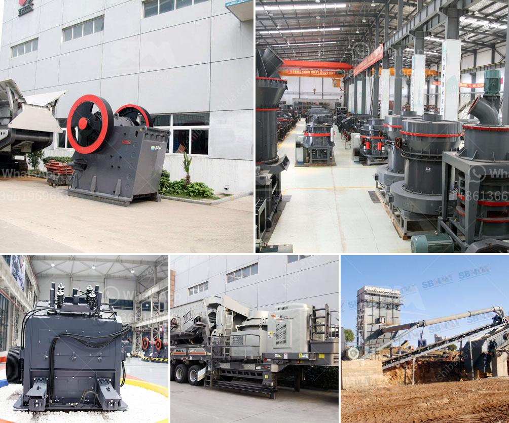

<h3>quartz grinding machine cost</h3>
Quartz is a mineral found in many forms, including quartz sand, quartz stone, and quartzite. The world of quartz offers a wide variety of applications due to its physical and chemical properties, such as resistance to high temperatures, hardness, and durability. Consequently, quartz is widely used in the production of glass, ceramics, and other materials. The process of obtaining quartz powders of various sizes and shapes requires the use of specialized equipment, such as quartz grinding machines.

Quartz grinding machines are industrial equipment used for grinding quartz into powders with different fineness levels. Different grinding machines have different prices due to their different production capacities and performances. For instance, large-scale equipment with high capacity and automation capabilities tend to be more expensive compared to smaller machines with lower capacities and fewer features.

The cost of a quartz grinding machine can range from a few hundred thousand to several million dollars, depending on the specific model, capacity, and complexity of the machinery. Additionally, factors such as raw material availability, labor costs, power consumption, and maintenance expenses contribute to the overall cost of owning and operating a quartz grinding machine. Therefore, it is crucial for businesses to carefully consider their needs, budget, and long-term objectives before investing in such equipment.

One of the main factors influencing the cost of a quartz grinding machine is the overall production capacity. Machines with higher capacity and performance tend to have a higher initial cost due to their more robust construction, increased power requirements, and enhanced automation features. These machines are ideal for large-scale industrial settings where a significant amount of quartz powder is required on a daily basis. On the other hand, smaller machines are generally more affordable and suitable for smaller-scale operations or start-ups with limited budgets and lower production demands.

Maintenance and operating costs should also be considered when evaluating the cost of a quartz grinding machine. Regular maintenance and repairs are necessary to ensure optimal and consistent performance of the equipment. These expenses can include the cost of replacement parts, lubricants, and the labor involved in regular inspections and repairs. Additionally, energy consumption plays a significant role in the operational cost of the grinding machine, as powerful motors and sophisticated control systems are often used in these machines. Therefore, businesses must account for the energy consumption of the machine and its impact on the overall cost of production.

In conclusion, the cost of a quartz grinding machine varies depending on factors such as the production capacity, performance, automation features, and maintenance requirements. Businesses should carefully assess their needs, budget, and long-term objectives to choose the right machine for their quartz grinding operations. While larger machines with higher capacity and automation tend to have higher upfront costs, they can offer significant benefits in terms of overall productivity and efficiency. It is essential to consider both the initial investment and the long-term operational costs when making a decision about purchasing a quartz grinding machine.
<h3>Contact us</h3><ul><li><strong>Whatsapp:&nbsp;<a href="https://wa.me/8613661969651">+8613661969651</a></strong></li><li><a href="https://swt.shibang-china.com/?git&amp;zhl&amp;quartz grinding machine cost"><strong>Online Service(chat now)</strong></a></li></ul><h3>Related</h3><ul><li><a href='the gold mining process in zimbabwe.md'>the gold mining process in zimbabwe</a></li><li><a href='capacity 1 to 5 tons per hour price.md'>capacity 1 to 5 tons per hour price</a></li><li><a href='stone crusher machine for sale uae.md'>stone crusher machine for sale uae</a></li><li><a href='china crusher sale.md'>china crusher sale</a></li><li><a href='talc powder plant.md'>talc powder plant</a></li></ul>