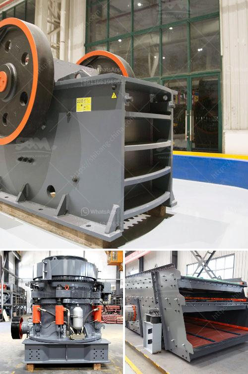

<h3>quartz mining process</h3>
Quartz is a mineral abundant on our planet's crust and has various industrial uses due to its unique properties. One of the main applications of quartz is in the construction industry, where it is used as an important ingredient in making glass, concrete, and other building materials. However, the process of extracting quartz from its natural deposits involves several steps.

The first step in quartz mining is the exploration of potential sites. Geologists search for areas with high concentrations of quartz and gather samples for analysis. This is done through various methods, including remote sensing and drilling.

Once a potential deposit is identified, the next step is to assess its quality and quantity. This is important, as it determines whether the site is economically viable for mining. Samples are taken from different areas within the deposit and analyzed for their quartz content and purity.

After evaluating the deposit, mining operations can begin. Typically, surface mining methods are employed to extract quartz. This involves removing vegetation, topsoil, and overburden to expose the quartz layer. Depending on the depth of the deposit, heavy machinery, such as excavators, loaders, and haul trucks, may be used to facilitate the mining process.

Once the quartz layer is exposed, it is blasted and then extracted using large shovels or bulldozers. The extracted quartz is then transported to a crushing plant where it is broken down into smaller pieces. The crushing process reduces the quartz to a desired size, which can range from tiny granules to fine powder.

The crushed quartz is then washed, sorted, and purified through various techniques to remove impurities. This can involve using chemicals, gravity separation, and magnetic separation. The final step is drying the quartz to remove any remaining moisture and ensure its suitability for various industrial applications.

In conclusion, quartz mining is a complex process involving exploration, assessment, extraction, crushing, purification, and drying. It is a crucial stage in the production of quartz for numerous industries. By understanding the mining process, we can ensure the sustainable extraction of this valuable mineral resource.
<h3>Contact us</h3><ul><li><strong>Whatsapp:&nbsp;<a href="https://wa.me/8613661969651">+8613661969651</a></strong></li><li><a href="https://swt.shibang-china.com/?git&amp;zhl&amp;quartz mining process"><strong>Online Service(chat now)</strong></a></li></ul><h3>Related</h3><ul><li><a href='quarry crusher equipment supplier.md'>quarry crusher equipment supplier</a></li><li><a href='jaw crusher in germany used.md'>jaw crusher in germany used</a></li><li><a href='crossley economy x ball mill.md'>crossley economy x ball mill</a></li><li><a href='cost of gold beneficiation plant.md'>cost of gold beneficiation plant</a></li><li><a href='grinding ball mill.md'>grinding ball mill</a></li></ul>