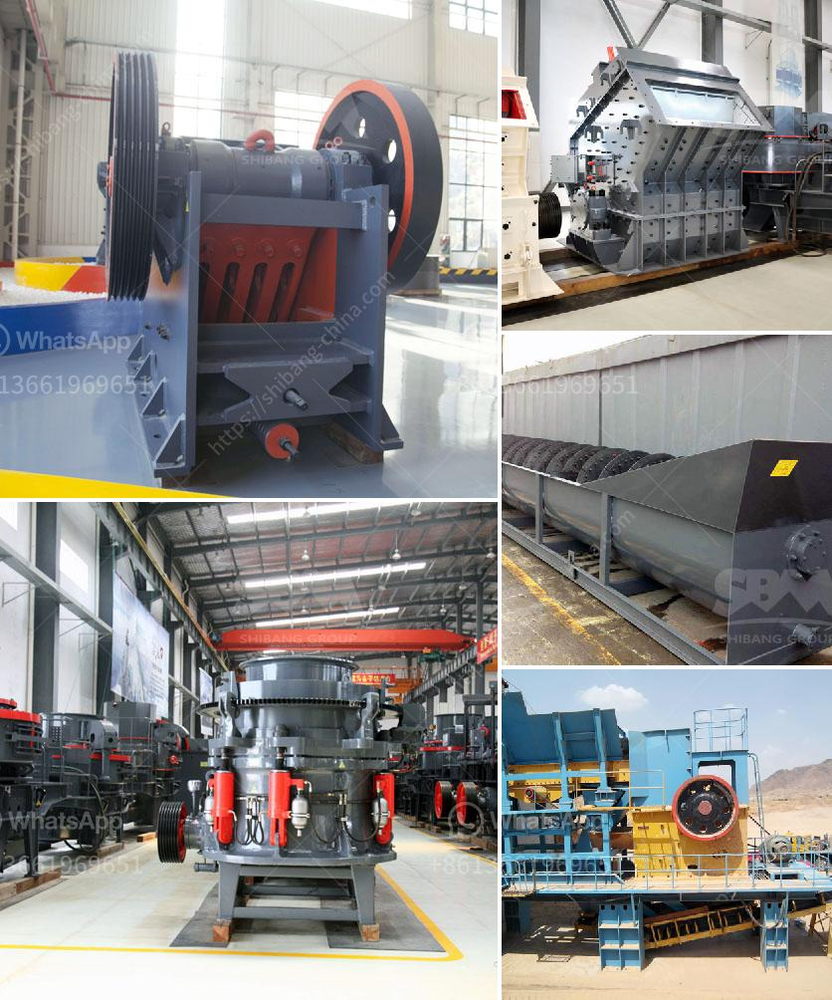

<h3>quartz plants for sale</h3>
Quartz plants are gaining popularity among plant enthusiasts worldwide. These stunning plants are known for their unique and captivating beauty, making them a trendy choice for both indoor and outdoor gardens. With their wide range of colors, shapes, and sizes, quartz plants have become highly sought after, leading to an increase in quartz plant sales.

One of the reasons why quartz plants are in high demand is their remarkable resilience. Unlike many other plants, quartz plants are incredibly hardy and can withstand a wide range of growing conditions. This makes them suitable for beginners who may lack gardening experience, as well as seasoned gardeners looking to add a touch of elegance to their collection.

Quartz plants also require minimal care, making them low-maintenance companions for our busy lifestyles. These plants are known for their ability to thrive in various light conditions, including bright indirect light, making them perfect for indoor spaces with limited natural light. Additionally, quartz plants have low water requirements, eliminating the need for frequent watering, which is an added advantage for those who tend to forget or are often away from home.

When it comes to aesthetics, quartz plants are simply breathtaking. Their vibrant, colorful leaves come in a range of shades, such as deep greens, rich purples, and even splashes of fiery reds and oranges. The striking patterns and intricate texture of their leaves make quartz plants a unique and eye-catching addition to any space. Whether placed on a table, a shelf, or as a centerpiece, quartz plants are sure to become a conversation starter and a focal point in any room.

Another reason for the surge in quartz plant sales is their versatility. These plants can be grown in various ways, allowing enthusiasts to explore their creativity. Quartz plants can be potted in traditional planters or displayed in hanging baskets, adding a touch of elegance to both indoor and outdoor environments. Additionally, quartz plants can be propagated easily, providing an opportunity for plant lovers to expand their collection and share the joy of growing these stunning plants with family and friends.

With the rising interest in quartz plants, it is no surprise that the market has responded with a wide variety of options for buyers. Many nurseries and online sellers now offer an extensive selection of quartz plants for sale, allowing customers to choose the perfect plant that matches their preferences and style. Whether you are looking for a compact quartz plant for a small space or a large statement piece to enhance your garden, there is undoubtedly a quartz plant available that suits your needs.

In conclusion, quartz plants are captivating, resilient, and versatile plants that have become highly sought after in the gardening community. Their low-maintenance requirements, stunning aesthetics, and a wide range of options make them an attractive addition to any home or garden. If you are looking to add a touch of elegance and visual interest to your space, consider adding a quartz plant to your collection. With the growing availability of quartz plants for sale, it is now easier than ever to find the perfect plant to enhance your living environment.
<h3>Contact us</h3><ul><li><strong>Whatsapp:&nbsp;<a href="https://wa.me/8613661969651">+8613661969651</a></strong></li><li><a href="https://swt.shibang-china.com/?git&amp;zhl&amp;quartz plants for sale"><strong>Online Service(chat now)</strong></a></li></ul><h3>Related</h3><ul><li><a href='crushing plant thailand.md'>crushing plant thailand</a></li><li><a href='ball mills price.md'>ball mills price</a></li><li><a href='grinding mills suppliers in china.md'>grinding mills suppliers in china</a></li><li><a href='mobile screening machine south africa.md'>mobile screening machine south africa</a></li><li><a href='graphite production machine.md'>graphite production machine</a></li></ul>