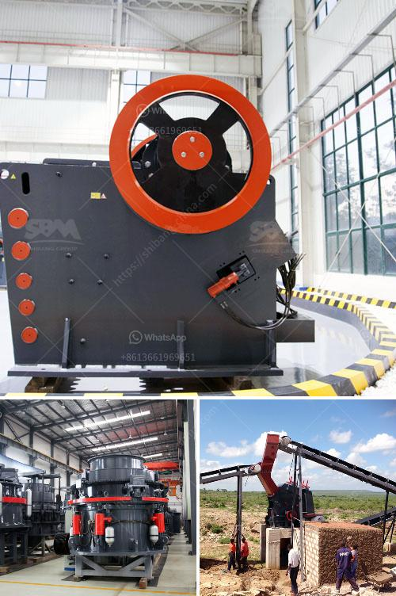

<h3>quartz silica crusher plant sale at telangana</h3>
Quartz silica is a mineral that is commonly found in nature. It is a hard and crystalline form of silica that is used in various industries, such as glass manufacturing, ceramics, and construction. The quartz silica crusher plant is a key component in facilitating the production of quartz silica powder.

To ensure excellence and uninterrupted plant operations, proper maintenance and servicing is essential. The quartz crushing plant includes a vibrating feeder, a jaw crusher, a cone crusher, vibrating screen, and belt conveyors. The vibrating feeder is responsible for feeding quartz silica evenly into the jaw crusher. The jaw crusher is responsible for primary crushing, breaking down the large rocks into smaller, more manageable pieces.

Once the quartz silica has been crushed, it is then sent to the cone crusher. The cone crusher further breaks down the quartz silica into smaller pieces for processing. It is important to note that the size of the crushed material can greatly affect the quality and strength of the final product. Therefore, the cone crusher must be properly maintained and adjusted to ensure precise and efficient crushing.

After the quartz silica has been crushed, it is then screened using a vibrating screen. The vibrating screen separates the crushed material into different sizes, depending on the requirements of the customer. The properly sized quartz silica is then transported via belt conveyors to storage or further processing.

In Telangana, the quartz silica crusher plant sale is a major contributor to the economy and the demand for quartz silica is constantly on the rise. Suppliers of quartz silica sand crusher plant in Telangana andhra pradesh, India are seeing immense growth in the industry.

For instance, many industries rely on quartz silica sand for the manufacturing of their products. This includes industries like construction, glass manufacturing, ceramics, and even the solar industry. With such a vast range of applications, the demand for quartz silica is only expected to increase in the future.

Furthermore, the quartz silica crusher plant sale in Telangana is not only a significant contributor to the state's economy but also a source of employment for numerous individuals. The operation of the quartz silica crusher plant requires highly skilled workers who can handle various machinery and equipment. These workers are responsible for ensuring the smooth and efficient operation of the plant.

It is important to note that the quartz silica crusher plant sale in Telangana relies on machinery and equipment that are highly specialized in nature. Therefore, the owners and operators of such plants must invest in regular maintenance and servicing to ensure optimal performance. This can help prevent breakdowns and increase the lifespan of the equipment, ultimately resulting in greater productivity and profitability.

In conclusion, the quartz silica crusher plant sale in Telangana is a significant contributor to the state's economy and a valuable resource for various industries. The proper maintenance and servicing of the plant are crucial to ensure uninterrupted operations and the production of high-quality quartz silica for various applications. With the growing demand for quartz silica, the industry is poised for further growth and development in the coming years.
<h3>Contact us</h3><ul><li><strong>Whatsapp:&nbsp;<a href="https://wa.me/8613661969651">+8613661969651</a></strong></li><li><a href="https://swt.shibang-china.com/?git&amp;zhl&amp;quartz silica crusher plant sale at telangana"><strong>Online Service(chat now)</strong></a></li></ul><h3>Related</h3><ul><li><a href='limestone rock crushing.md'>limestone rock crushing</a></li><li><a href='gypsum board machinery manufacturers india.md'>gypsum board machinery manufacturers india</a></li><li><a href='difeerence between jow crusher and hammer mill.md'>difeerence between jow crusher and hammer mill</a></li><li><a href='mobile jaw crushers for sale in italy.md'>mobile jaw crushers for sale in italy</a></li><li><a href='quarry crusher equipment for sale in south africa.md'>quarry crusher equipment for sale in south africa</a></li></ul>