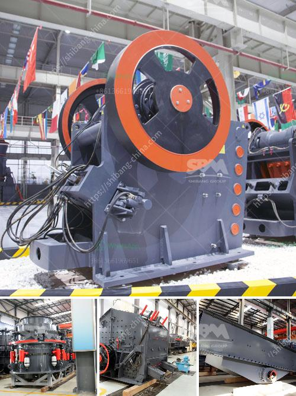

<h3>quartz stone crushing milling</h3>
Quartz stone, commonly known as quartz sand, is a kind of hard, wear-resistant, chemical stability minerals. It offers many advantages such as high crushing efficiency, low production cost, handling capacity, and good finished product shape. Quartz stone crushing milling is an essential stage of quartz stone processing, which can crush various materials with a compressive strength of up to 320MPa.

Quartz stone crushing milling begins with primary crushing, followed by secondary crushing and finally fine crushing. The ore particles are evenly sent to the jaw crusher by the vibrating feeder for initial breaking. The crushed material is then sent to the cone crusher or impact crusher for further crushing. After screening, the required size quartz stone particles are sent to the sand making machine through the belt conveyor for sand making. The finished product is sieved by a vibrating screen, and the quartz sand with qualified particle size is sent to the storage silo through the bucket elevator. The coarse particles are returned to the sand making machine for regrinding.

The crushing process of quartz stone is relatively simple. The typical production line uses jaw crusher, impact crusher, sand making machine, vibrating screen, feeder, and other equipment to process quartz stone, making it more suitable for processing quartz stone particles with a high content of quartz. Quartz stone crushing milling can greatly reduce the investment cost and ensure the quality of quartz sand.

In the production process of quartz stone, it is necessary to choose the appropriate crusher equipment and grinding equipment according to the application of quartz stone. If the quartz stone needs to be used for further processing, it is necessary to choose the crusher with relatively large crushing ratio and fine crushing effect. It is recommended to use cone crusher or impact crusher. If only sand making is needed, the jaw crusher and sand making machine are sufficient.

In terms of milling equipment, Raymond mill, ball mill, and ultrafine mill are commonly used. Raymond mill is suitable for processing ores with a Mohs hardness of less than 9 and a humidity of less than 6%. It has stable performance, wide application range, and high cost performance. Ball mill is suitable for dry and wet grinding of various ores and other materials. It has the advantages of low power consumption, low investment cost, and high grinding efficiency. Ultrafine mill is the preferred milling equipment for processing quartz stone powder. It has the characteristics of high fineness, wide application range, and strong grinding ability.

In conclusion, crushing and milling process play an important role in the quartz stone processing. Suitable crushing and milling equipment can effectively improve the production efficiency and reduce the production cost of quartz stone. When choosing equipment, it is necessary to consider the characteristics of quartz stone and the requirements of the final product to select the appropriate equipment. With the continuous improvement of technology, more efficient and energy-saving quartz stone crushing milling equipment will be developed and applied, making the quartz stone processing industry more prosperous and the investment more cost-effective.
<h3>Contact us</h3><ul><li><strong>Whatsapp:&nbsp;<a href="https://wa.me/8613661969651">+8613661969651</a></strong></li><li><a href="https://swt.shibang-china.com/?git&amp;zhl&amp;quartz stone crushing milling"><strong>Online Service(chat now)</strong></a></li></ul><h3>Related</h3><ul><li><a href='aggregate washing machine.md'>aggregate washing machine</a></li><li><a href='cone crusher manufacturer in south africa.md'>cone crusher manufacturer in south africa</a></li><li><a href='industrial crusher machine.md'>industrial crusher machine</a></li><li><a href='gypsum board manufacturing machine price.md'>gypsum board manufacturing machine price</a></li><li><a href='china gold processing plant.md'>china gold processing plant</a></li></ul>