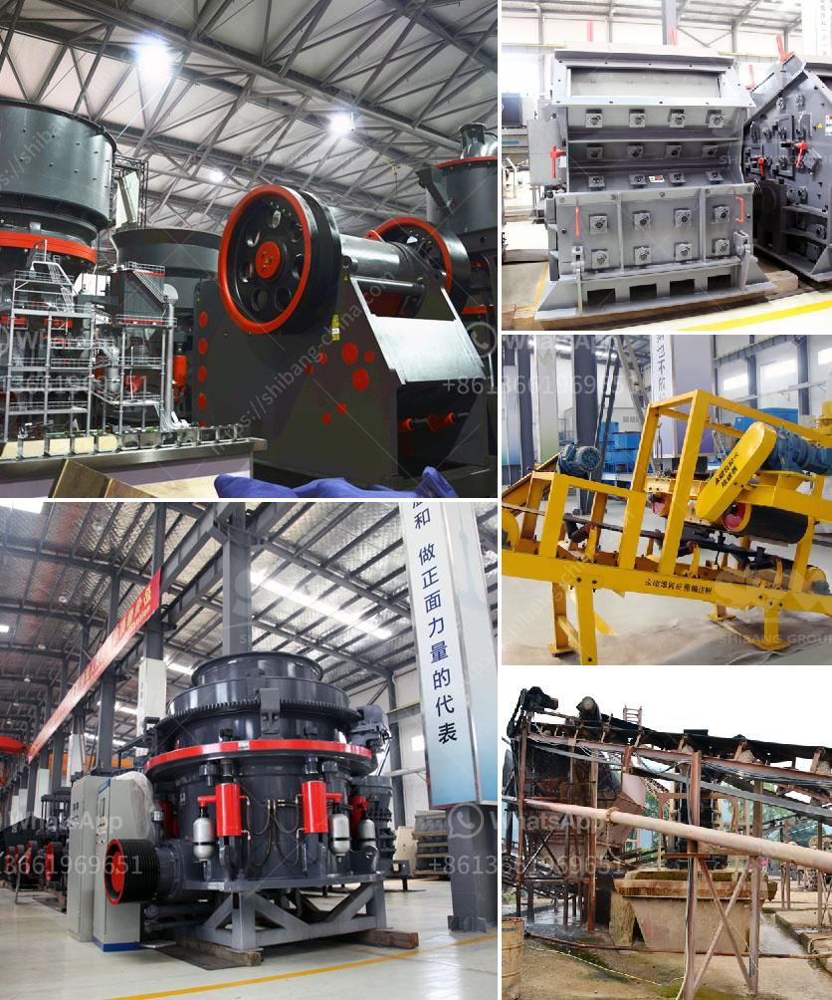

<h3>quartz stone dust equipment</h3>
Quartz stone dust equipment refers to the equipment used in the production of quartz stone dust, which is used as a raw material in the manufacturing of various types of products such as countertops, tiles, and flooring. This article will discuss the importance of quartz stone dust equipment and its various uses in the industry.

Quartz stone dust is a by-product of quartz stone manufacturing processes. It is produced when quartz crystals are crushed into fine particles during the cutting and grinding process. This fine dust is often collected and used as a raw material in the production of various products.

One of the main uses of quartz stone dust is in the manufacturing of countertops. Quartz countertops are highly popular due to their durability, stain resistance, and aesthetic appeal. Quartz stone dust is combined with resin and pigments to create a strong and beautiful surface for countertops. The equipment used in this process includes crushing and grinding machines to reduce the quartz crystals into fine particles and mixers to combine the dust with resin and pigments.

Another application of quartz stone dust equipment is in the production of quartz tiles and flooring. Quartz tiles are preferred in various settings, including commercial buildings, residential homes, and even outdoor spaces, due to their durability and low maintenance requirements. The dust is mixed with binders and shaped into tiles using specialized machinery. The equipment used in this process includes mixing machines, tile press machines, and polishing machines to achieve the desired finish.

In addition to countertops and tiles, quartz stone dust is also used in the manufacturing of other products such as bathroom vanities, sinks, and wall panels. These products require the use of specialized equipment to shape, mold, and polish the dust into the desired form. This equipment is crucial in ensuring the quality and consistency of the final products.

The use of quartz stone dust equipment offers several advantages to manufacturers. Firstly, it allows for efficient and uniform production of quartz-based products. The equipment ensures that the quartz stone dust is properly crushed, mixed, and shaped, resulting in consistent quality and appearance of the final products.

Secondly, using specialized equipment in the production process increases productivity and reduces labor costs. The machinery used in crushing, mixing, and shaping quartz stone dust can handle large volumes, reducing the time and effort required for production. This not only lowers labor costs but also allows manufacturers to meet large orders and demand in a timely manner.

Lastly, quartz stone dust equipment contributes to sustainability in manufacturing. By utilizing the by-product of quartz stone manufacturing processes, manufacturers can reduce waste and minimize environmental impact. The equipment ensures that the dust is efficiently collected, processed, and utilized, reducing the need for additional raw materials.

In conclusion, quartz stone dust equipment plays a vital role in the manufacturing industry. It enables the efficient production of various quartz-based products such as countertops, tiles, and flooring. The equipment ensures consistent quality, increases productivity, and contributes to sustainability in manufacturing processes. As the demand for quartz-based products continues to rise, the importance of quartz stone dust equipment cannot be overlooked.
<h3>Contact us</h3><ul><li><strong>Whatsapp:&nbsp;<a href="https://wa.me/8613661969651">+8613661969651</a></strong></li><li><a href="https://swt.shibang-china.com/?git&amp;zhl&amp;quartz stone dust equipment"><strong>Online Service(chat now)</strong></a></li></ul><h3>Related</h3><ul><li><a href='ball mills prices.md'>ball mills prices</a></li><li><a href='mobile coal crusher for sale in south africa.md'>mobile coal crusher for sale in south africa</a></li><li><a href='grinding of limestone crusher.md'>grinding of limestone crusher</a></li><li><a href='sand core machine manufacturers.md'>sand core machine manufacturers</a></li><li><a href='ball mill manufacturers china.md'>ball mill manufacturers china</a></li></ul>