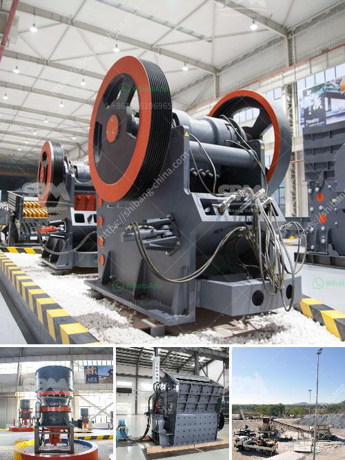

<h3>quartz stone machine of india</h3>
Quartz stone has gained immense popularity in recent years due to its durability, versatility, and aesthetic appeal. It has become a preferred choice for homeowners, architects, and interior designers. The high demand for quartz stone has led to the development of advanced machinery in India to cater to the growing needs of the industry.

India is known for its rich reserves of quartz stone, making it an ideal location for the manufacturing of quartz stone machines. The country has a robust infrastructure and skilled workforce, making it a global hub for the production of high-quality quartz stone machines.

One of the leading manufacturers of quartz stone machines in India is Breton India. Breton India is a subsidiary of the Breton Group, a global leader in stone machine technology. The company has been operating in India since 2005 and has established itself as a reliable and innovative provider of quartz stone machines.

Breton India offers a wide range of cutting-edge machinery for the production of quartz stone slabs. Their machines are designed to provide superior precision, efficiency, and productivity, enabling manufacturers to meet the increasing demand for quartz stone in a cost-effective manner.

The flagship product of Breton India is the Bretonstone® system, which combines advanced technology and craftsmanship to create stunning quartz stone slabs. The system comprises several machines, including the Bretonstone® Block Cutting Machine, Bretonstone® Slab Polishing Machine, and Bretonstone® Pavers Press.

The Bretonstone® Block Cutting Machine is equipped with diamond wires, enabling precise and fast cutting of quartz stone blocks. It ensures maximum yield and reduces wastage, resulting in cost savings for manufacturers. The machine is also equipped with advanced sensors and control systems for optimal performance.

The Bretonstone® Slab Polishing Machine is designed to enhance the aesthetics of quartz stone slabs. It provides a high-gloss finish, bringing out the natural beauty of the stone. The machine is equipped with multiple polishing heads and abrasives, ensuring an even and flawless surface.

The Bretonstone® Pavers Press is used to create quartz stone pavers, which are highly sought after for exterior applications. The machine applies high pressure and heat to the quartz stone mixture, resulting in durable and weather-resistant pavers. The pavers can be customized in various sizes, shapes, and colors to meet specific design requirements.

Breton India also offers a range of supplementary machines, such as resin-treating plants, resin-hardening ovens, and automatic handling systems. These machines further enhance the efficiency and productivity of the quartz stone manufacturing process.

In addition to manufacturing quartz stone machines, Breton India provides comprehensive after-sales support, including installation, training, and technical assistance. Their team of experts ensures that customers can maximize the performance of their machines and achieve optimal results.

With the advancement of quartz stone machine technology in India, manufacturers can produce high-quality quartz stone slabs efficiently and cost-effectively. The availability of such advanced machinery has contributed to the growth of the quartz stone industry in the country and has positioned India as a global leader in this sector.
<h3>Contact us</h3><ul><li><strong>Whatsapp:&nbsp;<a href="https://wa.me/8613661969651">+8613661969651</a></strong></li><li><a href="https://swt.shibang-china.com/?git&amp;zhl&amp;quartz stone machine of india"><strong>Online Service(chat now)</strong></a></li></ul><h3>Related</h3><ul><li><a href='sample of joint operations agreement quarry mining.md'>sample of joint operations agreement quarry mining</a></li><li><a href='raymond mill for sale second hand.md'>raymond mill for sale second hand</a></li><li><a href='dubai stone crushing auction.md'>dubai stone crushing auction</a></li><li><a href='gold mining equipment for sale in egypt.md'>gold mining equipment for sale in egypt</a></li><li><a href='design of screening machines.md'>design of screening machines</a></li></ul>