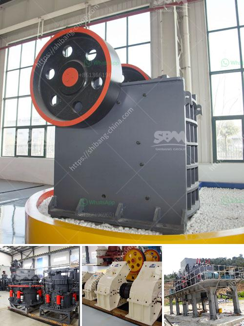

<h3>quartz stone machine</h3>
In the stone fabrication industry, precision and efficiency are of utmost importance. Every piece of stone must be cut and shaped with precision to ensure a perfect fit and an elegant finish. This is where quartz stone machines come into play. These cutting-edge machines have revolutionized the stone fabrication industry by combining technology and craftsmanship to deliver an exceptional finished product.

A quartz stone machine is a state-of-the-art piece of equipment that utilizes advanced technology to cut, shape, and polish quartz slabs with unparalleled precision. These machines are specifically designed to work with quartz, a popular choice for countertops and other applications, due to its durability and aesthetic appeal.

One of the key features of quartz stone machines is their ability to cut and shape quartz slabs with extreme accuracy. The precision of these machines ensures that every cut is perfect, resulting in tight seams and seamless joints. This level of precision would be nearly impossible to achieve manually, making the quartz stone machine an invaluable tool in the stone fabrication process.

Another advantage of quartz stone machines is their efficiency. These machines are designed to optimize speed and productivity while maintaining quality. The automated features of the machine allow for faster processing times, reducing the overall fabrication time. This ensures that stone fabricators can deliver their projects on time, meeting the expectations of their clients.

Moreover, quartz stone machines are equipped with advanced software and control systems that enhance their efficiency. These intelligent systems can be programmed to perform various tasks, such as cutting, shaping, and polishing, with minimal human intervention. This not only reduces the workload on stone fabricators but also eliminates the possibility of human error, leading to a higher degree of accuracy and consistency.

The use of quartz stone machines also contributes to the sustainability of the stone fabrication industry. These machines are equipped with dust control systems that effectively capture and contain the debris generated during the cutting and shaping processes. This prevents harmful particles from being released into the air, ensuring a healthier working environment for stone fabricators and reducing the impact on the surrounding ecosystem.

In conclusion, quartz stone machines have revolutionized the stone fabrication industry by combining technology and craftsmanship to deliver precise and efficient results. These machines not only improve the overall quality of the finished product but also enhance the productivity and sustainability of the stone fabrication process. With their advanced features and automated systems, quartz stone machines have become an irreplaceable tool in the stone fabricator's arsenal. By investing in these cutting-edge machines, stone fabricators can meet the demands of their clients while staying ahead in an increasingly competitive market.
<h3>Contact us</h3><ul><li><strong>Whatsapp:&nbsp;<a href="https://wa.me/8613661969651">+8613661969651</a></strong></li><li><a href="https://swt.shibang-china.com/?git&amp;zhl&amp;quartz stone machine"><strong>Online Service(chat now)</strong></a></li></ul><h3>Related</h3><ul><li><a href='mobile jaw crushers.md'>mobile jaw crushers</a></li><li><a href='stone crusher manufacturers.md'>stone crusher manufacturers</a></li><li><a href='kaolin portable crusher provider in nigeria.md'>kaolin portable crusher provider in nigeria</a></li><li><a href='small sand grinding machine in india.md'>small sand grinding machine in india</a></li><li><a href='crusher screener forsale in sweden.md'>crusher screener forsale in sweden</a></li></ul>