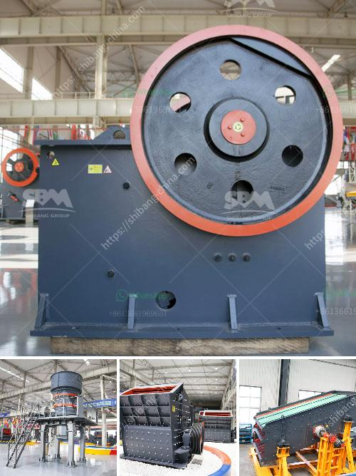

<h3>raymond mill for grinding gypsum</h3>
Raymond mill is a specialized machine used for grinding gypsum and other non-metallic minerals. Gypsum powder has many applications in various industries, such as construction, agriculture, and chemical companies. It is an important industrial raw material, which is widely used in cement, papermaking, paint, plastic, food, and other industries. In order to ensure the quality and efficiency of gypsum powder, it is necessary to choose an appropriate grinding mill.

Raymond mill, also known as R-series mill, is a common milling equipment for non-metallic minerals. It uses a three-dimensional structure, which covers a smaller area and has better performance in terms of efficiency, energy consumption, and environmental protection. The machine is equipped with a crushing system, milling system, and powder selection system, which can complete the whole process of grinding gypsum.

The relationship between the Raymond mill and gypsum is inseparable. The aircraft's unique milling system makes the grinding efficiency of the equipment greatly improved. Compared with other mills, the output is increased by more than 40% and the energy consumption of the unit grinding pressure is reduced by 30%. The equipment has the characteristics of high output, low energy consumption, and small occupation area. It effectively reduces the equipment investment and production cost, and is an ideal choice for large-scale production enterprises.

The Raymond mill has a wide range of applications in the grinding of gypsum. It can grind more than 280 kinds of materials with Mohs hardness below 9.3 and moisture content below 6%. The material has high processing efficiency and excellent particle size. Moreover, the gypsum powder produced by Raymond mill is more uniform and fine, and has better market competitiveness.

In addition, the Raymond mill has a unique dust removal system, which can effectively control the dust pollution in the production process. The machine is equipped with a high-pressure fan and a dust collector, which can achieve a dust-free production environment, reduce environmental pollution, and protect the health of operators.

Moreover, the Raymond mill has a high degree of automation. It can be controlled remotely, and the operation is simple and convenient. The machine has a high degree of intelligence, and it can be adjusted according to different production needs. It can be equipped with a variable frequency feeder, which can realize stepless speed regulation and improve the production efficiency.

In conclusion, the Raymond mill is an ideal equipment for grinding gypsum. It has the advantages of high efficiency, low energy consumption, small occupation area, and good environmental protection performance. It is widely used in the grinding of gypsum and other non-metallic minerals. With the continuous development of technology, the performance and application range of Raymond mill will be further improved, providing more choices for the grinding of gypsum and other materials.
<h3>Contact us</h3><ul><li><strong>Whatsapp:&nbsp;<a href="https://wa.me/8613661969651">+8613661969651</a></strong></li><li><a href="https://swt.shibang-china.com/?git&amp;zhl&amp;raymond mill for grinding gypsum"><strong>Online Service(chat now)</strong></a></li></ul><h3>Related</h3><ul><li><a href='stone crusher price of 30 tons per hour.md'>stone crusher price of 30 tons per hour</a></li><li><a href='cement grinding units in india basalt crusher quotes.md'>cement grinding units in india basalt crusher quotes</a></li><li><a href='belt conveyor supplier in china.md'>belt conveyor supplier in china</a></li><li><a href='small rock crushers in turkey.md'>small rock crushers in turkey</a></li><li><a href='turkey project gypsum powder production line.md'>turkey project gypsum powder production line</a></li></ul>