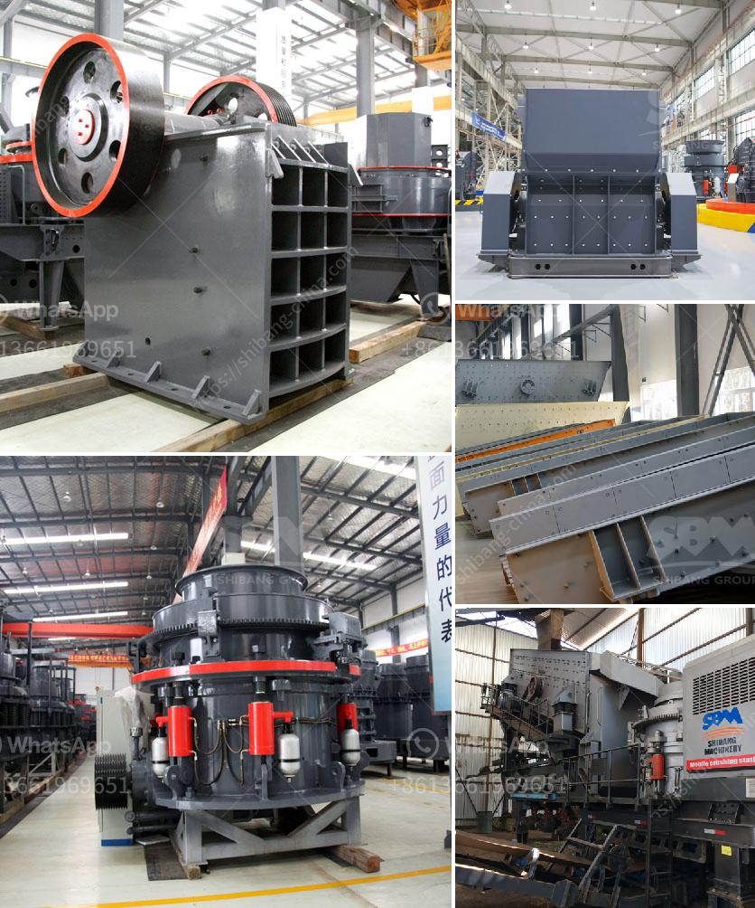

<h3>raymond mill for sale second hand</h3>
When looking for second-hand milling equipment, Raymond mills are a popular choice due to their low cost and high quality. With the increasing demand for barite, calcite, dolomite, marble, and other industries, the Raymond mill has become a necessary milling equipment for many businesses. In this article, we will explore why buying a second-hand Raymond mill can be beneficial and the factors to consider when doing so.

First and foremost, one of the main advantages of buying a second-hand Raymond mill is its affordability. Compared to brand new equipment, the price of a second-hand unit can be significantly lower, allowing budget-conscious businesses or individuals to make a cost-effective purchase. This allows small-scale businesses or those looking to expand their milling capacity to acquire a high-quality mill without breaking the bank.

Furthermore, the second-hand market for Raymond mills offers a wide range of options to choose from. As the demand for Raymond mills grows, more used units become available for sale. This means that buyers have the opportunity to select a mill that suits their specific needs, whether it's related to the processing capacity, motor power, production fineness, or any other requirement. With such a vast selection, businesses can find a second-hand Raymond mill that aligns perfectly with their milling objectives.

However, when considering the purchase of a second-hand Raymond mill, there are several factors that need to be taken into account. Firstly, it is essential to assess the condition of the mill and its components. Inspecting the milling equipment to ensure that it is in good working condition is crucial. Checking for any mechanical issues, wear and tear, or missing parts is an important step before making a purchase. Engaging the services of a professional technician or knowledgeable individual can help evaluate the condition of the Raymond mill accurately.

Another important factor to consider is the reputation of the seller. Buying from a reliable and reputable seller increases the likelihood of purchasing a quality second-hand Raymond mill. Do thorough research and seek recommendations from industry experts or professionals to identify trustworthy sellers who have a track record of offering reliable and well-maintained equipment.

Additionally, it is vital to consider the Raymond mill's maintenance history before finalizing the purchase. A well-maintained mill is likely to have a longer lifespan and provide better performance. Requesting the maintenance records and service history of the equipment will give an insight into how well it has been cared for and any repairs or part replacements it may have undergone.

In conclusion, opting for a second-hand Raymond mill can be a wise decision for businesses or individuals looking to acquire milling equipment at an affordable price without compromising on quality. The availability of various options and the opportunity to find the right mill for specific needs makes the second-hand market an attractive option. However, proper evaluation of the mill's condition, assessment of the seller's reputation, and consideration of the equipment's maintenance history are essential steps to ensure a satisfactory purchase.
<h3>Contact us</h3><ul><li><strong>Whatsapp:&nbsp;<a href="https://wa.me/8613661969651">+8613661969651</a></strong></li><li><a href="https://swt.shibang-china.com/?git&amp;zhl&amp;raymond mill for sale second hand"><strong>Online Service(chat now)</strong></a></li></ul><h3>Related</h3><ul><li><a href='feldspar powder ball mill.md'>feldspar powder ball mill</a></li><li><a href='quartz stone crushing milling.md'>quartz stone crushing milling</a></li><li><a href='coal mill in malaysia.md'>coal mill in malaysia</a></li><li><a href='lime powder machine.md'>lime powder machine</a></li><li><a href='crushing equipment south africa crusher quotes.md'>crushing equipment south africa crusher quotes</a></li></ul>