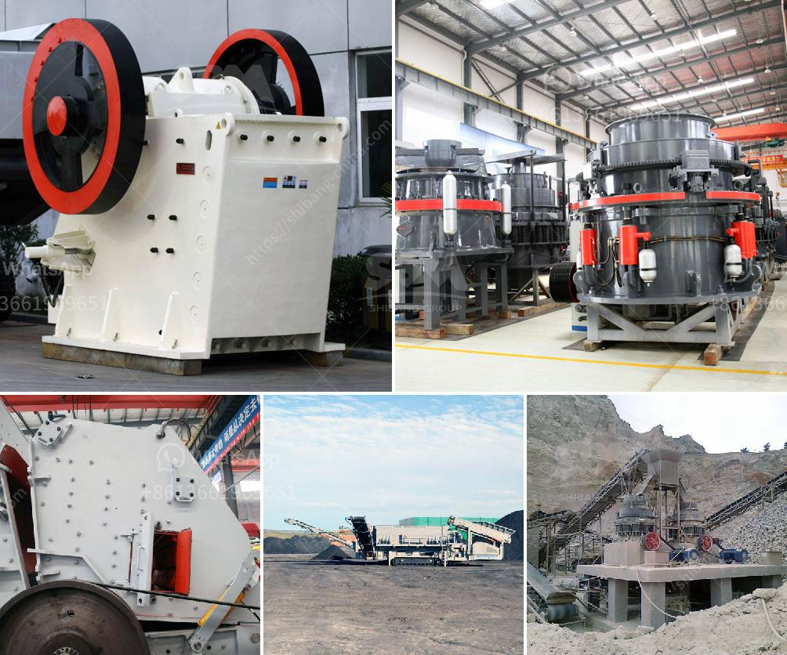

<h3>raymond mill in india</h3>
Raymond Mill: The Raymond Mill is a grinding machine, suitable for the preparation of various kinds of mineral powder and coal powder preparation. It is widely used in metallurgy, chemical, cement, coal, and other industries. It has a high degree of automation, a wide range of grinding materials, stable performance, and reliable operation. Raymond Mill in India is a common grinding equipment. It is mainly used for various kinds of powder production line of barite, calcite, potassium feldspar,limestone, talc, dolomite, gypsum, etc. It is also used for high fineness production of non flammable and non explosive minerals, chemicals, building materials with Mohs hardness less than 9.3 and humidity less than 6%.

Raymond mill in India has a long history and a wide range of applications. It can be used for grinding more than 280 kinds of non-flammable and non-explosive materials with hardness less than 7 and humidity less than 6%, such as barite, calcite, potassium feldspar, talc, marble, limestone, dolomite, fluorite, lime, activated clay, activated carbon, bentonite, kaolin, cement, phosphate rock, gypsum, glass, insulation materials, high-fine milling of more than 300 kinds of materials such as fine powder, and processing of non-inflammable and explosive materials with humidity below 6% in mining, metallurgy, chemical industry, building materials, and other industries.

One of the key factors contributing to the popularity of Raymond Mill is its low energy consumption. Compared with other grinding equipment, Raymond Mill has a higher grinding efficiency. The fineness of the grinding material can be adjusted between 80-400 mesh, which can achieve the purpose of multi-stage grinding and saving energy.

Another advantage of Raymond Mill is its small footprint. Raymond Mill occupies a small area, saves land resources, and can achieve high output. There are other types of mills that require a larger land area to be installed. The compact structure of Raymond Mill allows it to be placed in a small space for easy installation and transportation.

The high-quality parts used in Raymond Mill ensure its stable performance and long service life. The main grinding components are made of high-quality wear-resistant materials, which can effectively extend the service life of the equipment and reduce maintenance costs.

In conclusion, Raymond Mill is a good choice for India's grinding needs. It is suitable for processing various non-flammable and non-explosive mineral materials with Mohs hardness below 9.3 and humidity below 6%, it is widely used in the fields of metallurgy, construction, chemical industry, mining, highway construction, etc.
<h3>Contact us</h3><ul><li><strong>Whatsapp:&nbsp;<a href="https://wa.me/8613661969651">+8613661969651</a></strong></li><li><a href="https://swt.shibang-china.com/?git&amp;zhl&amp;raymond mill in india"><strong>Online Service(chat now)</strong></a></li></ul><h3>Related</h3><ul><li><a href='vsi crusher for crush sand.md'>vsi crusher for crush sand</a></li><li><a href='coal crusher machine prices in india.md'>coal crusher machine prices in india</a></li><li><a href='sample business plan for stone crusher.md'>sample business plan for stone crusher</a></li><li><a href='grinding mill in china.md'>grinding mill in china</a></li><li><a href='rotary dryer sales indonesia.md'>rotary dryer sales indonesia</a></li></ul>