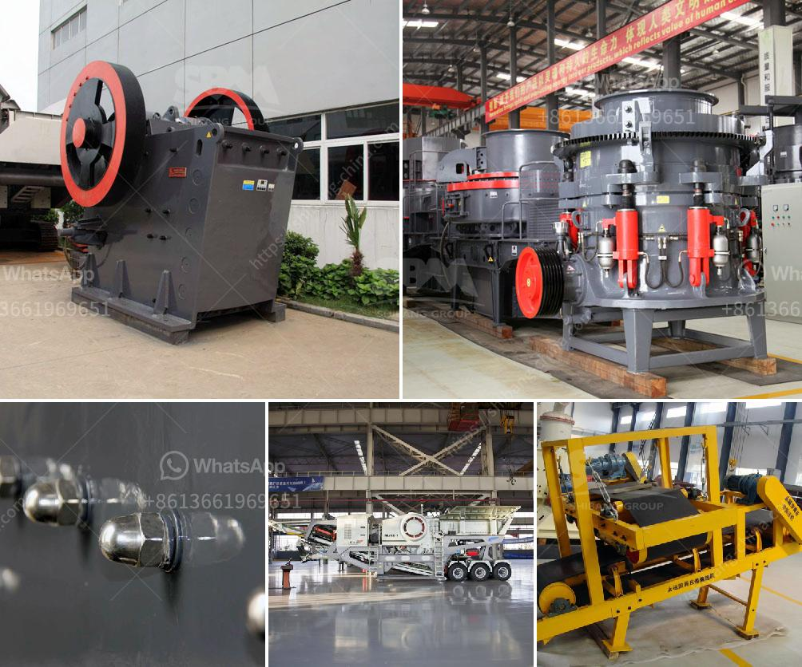

<h3>raymond mill micro pulverizer</h3>
In the world of grinding applications, various types of grinding mills have been developed for different purposes. These mills are widely used for grinding different types of materials into fine powder and are highly efficient in achieving the desired particle size and shape. One such mill that has gained immense popularity in recent years is the Raymond mill micro pulverizer.

Raymond mill micro pulverizer is specially designed for grinding various ores and non-metallic materials such as limestone, kaolin, coal, marble and so on. The fineness of the finished product can be adjusted from 325-2500 meshes according to requirements. It is an ideal choice for customers who want to grind materials into ultra-fine powder.

One of the key features of the Raymond mill micro pulverizer is its ability to finely crush and grind materials. It uses a combination of compression and cutting forces to reduce the size of the material. The grinding chamber consists of a series of rollers and a grinding ring. The material is fed into the grinding chamber through a hopper and is crushed by the rollers. The crushed material is then brought to the grinding ring where it is further pulverized into fine powder.

Another important feature of the Raymond mill micro pulverizer is its high efficiency. It is equipped with a powerful motor that generates a high-speed airflow within the grinding chamber. This airflow helps in the transportation of the material and ensures quick and efficient grinding. The high-speed airflow also helps in cooling the grinding chamber, preventing the material from getting overheated.

The Raymond mill micro pulverizer also has a built-in classifier that allows the particle size of the finished product to be controlled. The classifier separates the fine particles from the coarse ones and ensures that only the required size particles are discharged from the mill. This feature is particularly useful in industries such as mining, where the size of the final product is critical.

Moreover, the Raymond mill micro pulverizer is easy to maintain and operate. It has a simple and compact design, which makes it easy to install and dismantle. The grinding rollers are made of wear-resistant materials, ensuring long-term use without the need for frequent replacement. The mill is also equipped with an advanced control system that allows the operator to adjust various parameters such as grinding speed, airflow, and feed rate.

In conclusion, the Raymond mill micro pulverizer is a high-quality grinding mill that offers exceptional grinding and crushing capabilities. It is designed to meet the diverse grinding needs in various industries and ensure consistent particle size distribution. With its high efficiency, ease of operation, and low maintenance requirements, it is undoubtedly an excellent choice for any grinding application. Whether it is grinding limestone, coal, or any other material, the Raymond mill micro pulverizer is the ultimate solution.
<h3>Contact us</h3><ul><li><strong>Whatsapp:&nbsp;<a href="https://wa.me/8613661969651">+8613661969651</a></strong></li><li><a href="https://swt.shibang-china.com/?git&amp;zhl&amp;raymond mill micro pulverizer"><strong>Online Service(chat now)</strong></a></li></ul><h3>Related</h3><ul><li><a href='jaw crusher supplier of new zealand.md'>jaw crusher supplier of new zealand</a></li><li><a href='crushing and screening plants.md'>crushing and screening plants</a></li><li><a href='rock crushing cone.md'>rock crushing cone</a></li><li><a href='mobile stone crusher 100 tph bangalore.md'>mobile stone crusher 100 tph bangalore</a></li><li><a href='grinding machine information in hindi.md'>grinding machine information in hindi</a></li></ul>