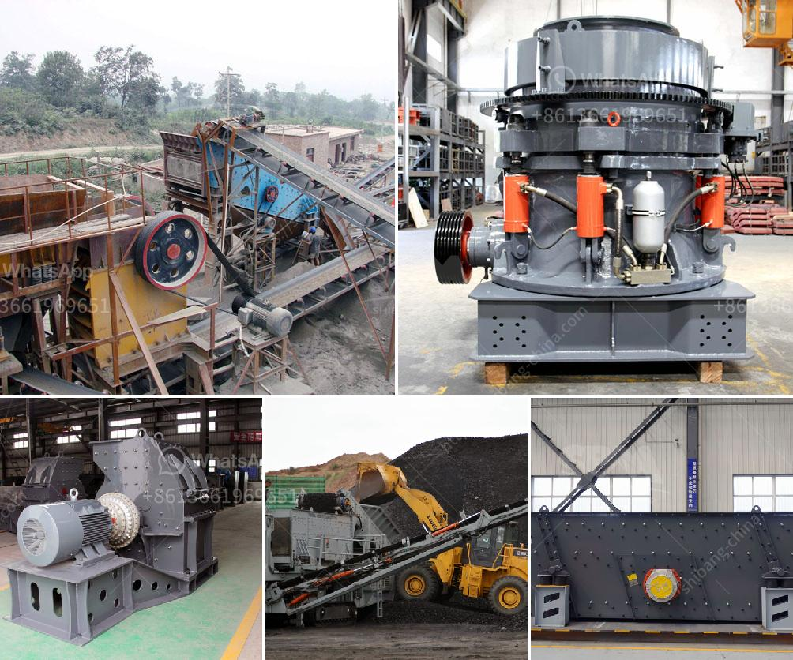

<h3>raymond mills for sale in pakistan</h3>
The importance of industrial machinery cannot be undermined in the present era. The industrial machinery sector is one of the key contributors to the economy of any country. However, to keep up with the growing demand for industrial machinery, manufacturers need to continuously upgrade their machinery. With the advancements in technology, outdated machinery becomes inefficient and is unable to cater to the ever-evolving needs of the industry. One such type of machinery that often needs to be replaced or upgraded is Raymond mills.

Raymond mills are widely used in the grinding of various non-metallic minerals and chemical materials. Raymond mills are commonly used in the chemical industry, building materials, metallurgy, agriculture, minerals processing, powder grinding, and fertilizer production industries. Raymond mills are often used to grind limestone, calcite, talc, dolomite, marble, granite, kaolin, and other non-metallic ores in a new generation of ore grinding equipment.

Raymond mills are widely used in building materials, chemical engineering, metallurgy, mineral processing, and other fields. These mills are characterized by high production efficiency, low energy consumption, environmental protection, and stable product quality. However, there are still some challenges faced by Raymond mills in Pakistan.

The first challenge is the lack of technology and knowledge about Raymond mills. Raymond mills are a relatively new type of mills in Pakistan. As a result, many buyers in Pakistan are unaware of the complete capabilities of Raymond mills. Therefore, it becomes crucial for sellers to provide comprehensive information about Raymond mills, their features, advantages, and applications. This awareness will enable potential buyers to make informed decisions and choose the right Raymond mill for their specific needs.

Another challenge faced by Raymond mills in Pakistan is the lack of available spare parts and maintenance facilities. If the necessary spare parts are not readily available, it can lead to prolonged downtime for the machines, affecting the overall production efficiency. Additionally, if there are no reliable maintenance facilities, it becomes challenging to keep the machines in a proper operational condition. As a result, potential buyers might hesitate to invest in Raymond mills.

Despite these challenges, there are several Raymond mill manufacturers in Pakistan. They offer a wide range of Raymond mills for sale, including those with different capacities, sizes, and specifications. To ensure customer satisfaction, many of these manufacturers also offer customization options. This allows buyers to get Raymond mills specifically tailored to their requirements.

In conclusion, Raymond mills are essential equipment for various industries in Pakistan. However, due to limited knowledge and available resources, Raymond mills face some challenges in the country. Manufacturers need to address these challenges by providing comprehensive information, reliable maintenance support, and readily available spare parts. By doing so, Raymond mills can continue to contribute to the growth of industries in Pakistan while meeting the demands of the ever-evolving industrial sector.
<h3>Contact us</h3><ul><li><strong>Whatsapp:&nbsp;<a href="https://wa.me/8613661969651">+8613661969651</a></strong></li><li><a href="https://swt.shibang-china.com/?git&amp;zhl&amp;raymond mills for sale in pakistan"><strong>Online Service(chat now)</strong></a></li></ul><h3>Related</h3><ul><li><a href='magnesium carbonate plant layout.md'>magnesium carbonate plant layout</a></li><li><a href='tons per day ball mill.md'>tons per day ball mill</a></li><li><a href='prices of conveyor belt.md'>prices of conveyor belt</a></li><li><a href='conical ball mill manufacturers in india.md'>conical ball mill manufacturers in india</a></li><li><a href='selling conveyor belts in kenya.md'>selling conveyor belts in kenya</a></li></ul>