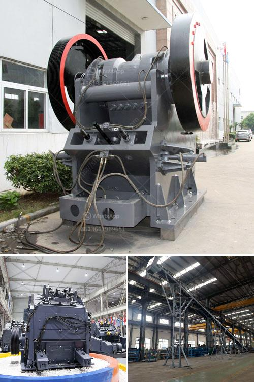

<h3>raymond mills in india</h3>
Indian economy is one of the fastest-growing economies globally, with multiple industries contributing to its growth. Raymond Mills is one crucial factor that fuels the growth of the Indian economy.

Raymond Mills in India are inherently great machinery for grinding minerals into fine powders. They are involved in the process of mining stones and minerals, breaking them down to a fine powder, powdering them, and then mincing them to turn them into a useful product. India produces a multitude of minerals like iron ore, coal, limestone, manganese, etc., which is a major factor behind its robust industrial growth. 

Raymond Mills have always been popular machines for grinding minerals into fine powders. The original mills were built with hanging roller sets, but Raymond Mills have evolved with time and now integrate multiple functionalities. The modern Raymond mill on the market achieves the purpose of fine powder production by using advanced technology and equipment.

Raymond Mills in India are commonly employed in the mining industry, including in metal ore, chemicals, construction materials, and metallurgy. Factors such as noise, dust pollution, and environmental issues are an essential consideration when selecting mill equipment. To provide a safe and environmentally friendly production environment, Raymond Mills in India have gone through a technical upgrade, with the addition of dust removal and noise reduction equipment, making them an efficient and low-noise equipment.

The Raymond Mill industry in India is on the boom and raymond mill is the core equipment in the industry. For the Raymond Mill industry in India, globalization has accelerated the cross-border flow of capital and technology. Currently, the Indian domestic market is mainly composed of several grinding mill suppliers, including Raymond, Promac, LOESCHE, and Shibang. For the current mining machinery industry in India, the Raymond Mill production line has been favored by many investors.

Today, the Raymond Mills in India are in the same mining industry as the pioneers in Germany. The reason why they can be sold in India at a higher price than other manufacturers is that most of the Indian suppliers have improvised and improved Raymond Mills in some way, making them more efficient and increasing production. This goes back to the core concept of Raymond Mills' original core technology, and the constant innovation and improvement have been integrated into the Raymond Mill industry in India. Raymond Mills' excellent performance in India has been constantly praised by users, making it an indispensable and reliable equipment in many industries.

In conclusion, the Raymond Mills in India have helped drive the Indian economy by providing a robust mineral grinding industry. They have provided jobs to thousands of workers, contributed to technological advancements, and boosted the overall economic growth. With the constant innovation and investment in Raymond Mills, India will continue to witness significant growth in various industrial sectors. The future of Raymond Mills in India looks bright as the demand for high-quality minerals continues to surge.
<h3>Contact us</h3><ul><li><strong>Whatsapp:&nbsp;<a href="https://wa.me/8613661969651">+8613661969651</a></strong></li><li><a href="https://swt.shibang-china.com/?git&amp;zhl&amp;raymond mills in india"><strong>Online Service(chat now)</strong></a></li></ul><h3>Related</h3><ul><li><a href='ball crusher gold machine.md'>ball crusher gold machine</a></li><li><a href='kaolin grindig companies in nigeria.md'>kaolin grindig companies in nigeria</a></li><li><a href='advantages of single toggle jaw crusher.md'>advantages of single toggle jaw crusher</a></li><li><a href='jual mesin hammer mill crusher for sale.md'>jual mesin hammer mill crusher for sale</a></li><li><a href='fly ash grinding mill.md'>fly ash grinding mill</a></li></ul>