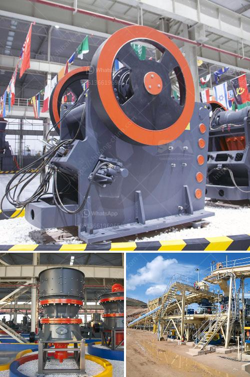

<h3>rent a portable conveyor belt system malaysia</h3>
Renting a portable conveyor belt system in Malaysia has never been easier. With a wide range of options available, choosing the right conveyor system can be a daunting task. However, by considering your specific needs and requirements, you can easily find the perfect conveyor belt system for your project.

One of the main advantages of renting a portable conveyor belt system is the flexibility it offers. Whether you need to move materials from one location to another, or you are looking to speed up your production process, a conveyor belt system is a cost-effective solution. By opting for a rental, you can ensure that you have access to the right equipment without making a long-term commitment.

There are several types of portable conveyor belt systems available in Malaysia, including those with adjustable heights, inclines, and lengths. This allows you to easily adapt the conveyor to your specific requirements, whether you are working in a warehouse, construction site, or any other industrial setting. These systems are designed to handle various materials, ranging from small and lightweight objects to heavy and bulky items.

Furthermore, renting a portable conveyor belt system means that you do not have to worry about maintenance and repair costs. The rental company will take care of any maintenance and repairs, ensuring that the conveyor belt system operates smoothly throughout your rental period. This eliminates the need for you to invest in expensive equipment or hire additional staff for maintenance purposes.

In conclusion, renting a portable conveyor belt system in Malaysia can greatly benefit your business. It provides you with the flexibility to choose the right equipment for your specific needs, while also avoiding the costs associated with purchasing and maintaining the equipment. With a wide range of options available, finding the perfect conveyor belt system has never been easier. So, whether you need to transport materials or streamline your production process, renting a portable conveyor belt system is a smart and convenient choice.
<h3>Contact us</h3><ul><li><strong>Whatsapp:&nbsp;<a href="https://wa.me/8613661969651">+8613661969651</a></strong></li><li><a href="https://swt.shibang-china.com/?git&amp;zhl&amp;rent a portable conveyor belt system malaysia"><strong>Online Service(chat now)</strong></a></li></ul><h3>Related</h3><ul><li><a href='selling conveyor belts in kenya.md'>selling conveyor belts in kenya</a></li><li><a href='gold mining crushing and milling machine.md'>gold mining crushing and milling machine</a></li><li><a href='crusher manufacturers in hyderabad.md'>crusher manufacturers in hyderabad</a></li><li><a href='iron ore magnetic separation from titanium process.md'>iron ore magnetic separation from titanium process</a></li><li><a href='crusher stone plant limpopo.md'>crusher stone plant limpopo</a></li></ul>