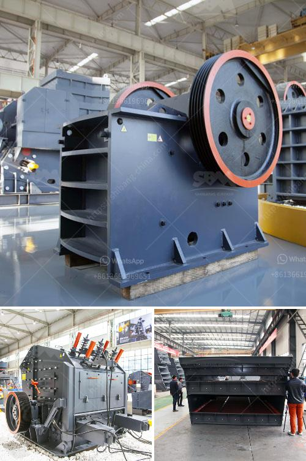

<h3>rental crusher rinda</h3>
Title: Exploring Rental Crusher Services in Rinda: A Convenient Solution for Construction and Mining Activities

In the bustling industrial hub of Rinda, Indonesia, the construction and mining sectors are experiencing exponential growth. As a result, the demand for heavy machinery, such as crushers, is rapidly increasing. Recognizing this need, rental crusher services have emerged as a convenient solution for businesses and individuals seeking efficient and cost-effective machinery to support their construction and mining projects. This article explores the benefits and services provided by rental crusher companies in Rinda.

Investing in a crusher can be a significant financial burden, particularly for small-scale businesses and individual contractors. Rental crusher services in Rinda offer a cost-effective alternative, allowing businesses to access high-quality machinery without upfront investment and the subsequent costs of maintenance, storage, and depreciation. By paying a transparent rental fee, businesses can allocate their capital towards other essential aspects of their projects, such as labor and raw materials.

Rental crusher companies in Rinda understand the diverse requirements of construction and mining projects. As a result, they offer a wide range of crushers suitable for various applications, including quarrying, demolition, recycling, and road construction. Whether contractors need jaw crushers, impact crushers, or cone crushers, rental companies have a range of options to meet their specific needs. This flexibility allows businesses to choose suitable equipment without being limited by their budget or the limited applications of purchased machinery.

One of the key advantages of opting for rental crusher services in Rinda is the access to technical expertise and support. These companies have skilled technicians experienced in maintaining, repairing, and troubleshooting crushers. They provide comprehensive assistance, ensuring the equipment is well-maintained and operates optimally throughout the project. In the unlikely event of any breakdown or malfunction, the rental company promptly responds and offers replacement machinery to minimize project downtime.

Crusher rental services prioritize customer satisfaction by maintaining a vast fleet of modern and well-maintained crushers. Businesses do not need to worry about costly delays caused by equipment unavailability or breakdown. Rental companies ensure a consistent supply of equipment, ensuring efficient project execution and timely completion. Moreover, rental companies regularly update their rental fleet with the latest models, providing access to cutting-edge technology.

Rental crusher services in Rinda also contribute to environmental sustainability. By sharing equipment among multiple projects, rental services significantly reduce the carbon footprint associated with manufacturing and transporting new machinery. Furthermore, reputable rental companies prioritize environmental compliance by adhering to emission standards and ensuring proper maintenance of their equipment.

Rental crusher services have become an invaluable resource for businesses and individuals engaged in the construction and mining sectors in Rinda. The cost-efficiency, flexibility, technical expertise, equipment availability, and environmental responsibility offered by these rental companies provide a convenient and sustainable solution to obtain high-quality crushers. By alleviating the financial burden of purchasing machinery, rental services empower businesses to focus on their core competencies and successfully execute their projects.
<h3>Contact us</h3><ul><li><strong>Whatsapp:&nbsp;<a href="https://wa.me/8613661969651">+8613661969651</a></strong></li><li><a href="https://swt.shibang-china.com/?git&amp;zhl&amp;rental crusher rinda"><strong>Online Service(chat now)</strong></a></li></ul><h3>Related</h3><ul><li><a href='stone crushing machines.md'>stone crushing machines</a></li><li><a href='crusher application.md'>crusher application</a></li><li><a href='stone crusher indonesia dan jerman.md'>stone crusher indonesia dan jerman</a></li><li><a href='stone crushing business plan.md'>stone crushing business plan</a></li><li><a href='gypsum powder equipment in turkey.md'>gypsum powder equipment in turkey</a></li></ul>