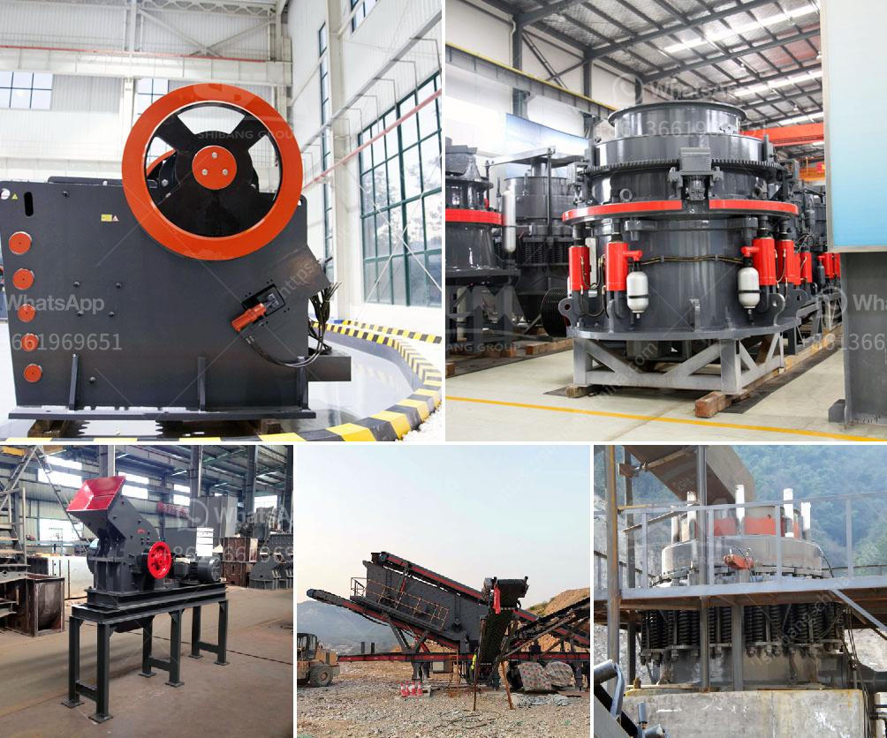

<h3>river stone crushing plant crusher</h3>
River stone crushing plant is the major crushing unit to process river stones like cobble rocks, pebble, sand & gravel, silica etc. It calls for crushing, screening and washing process. Bulk raw river stone is mined from the deposits on the river bed, then transported to the river stone crushing & screening plant. At the plant, raw river stone will be processed into smaller size by primary and secondary crushers in order to meet the size requirement of clients.

The river stone crushing plant is widely used in mining, building materials, metallurgy, chemical industry, transportation, water conservancy and other industries. It is suitable for crushing various ores and rocks with compression strength not exceeding 320MPa.

The design of the river stone crushing plant is also very user-friendly and flexible. The equipment configuration is flexible, as it can be independently used for production and combined with coarse crushing equipment for compound work. Additionally, the equipment adopts a new sealing structure design to ensure the stability of the whole machine during operation and extend its service life.

In terms of operation, the river stone crushing plant is easy to operate and maintain. It requires less maintenance as compared to other crushing plants. The hydraulic adjustment of the discharge opening and overload protection device provides easy operation and security, making it more reliable in operation.

The river stone crushing plant has a wide range of applications, including aggregates production, construction waste recycling, mining industrial, metallurgy, chemical industry, etc. It can crush all kinds of stones, such as basalt, granite, limestone, river pebble, iron ore, etc.

Overall, the river stone crushing plant is an excellent choice as the secondary crusher in the modern world. It has the features of high crushing efficiency, low energy consumption, adjustable product size and simple maintenance. Therefore, the river stone crushing plant is widely used in the construction industry and building materials industry for crushing, reshaping and screening of stones.
<h3>Contact us</h3><ul><li><strong>Whatsapp:&nbsp;<a href="https://wa.me/8613661969651">+8613661969651</a></strong></li><li><a href="https://swt.shibang-china.com/?git&amp;zhl&amp;river stone crushing plant crusher"><strong>Online Service(chat now)</strong></a></li></ul><h3>Related</h3><ul><li><a href='grinding ball mill philippines.md'>grinding ball mill philippines</a></li><li><a href='ball mills at best price in india.md'>ball mills at best price in india</a></li><li><a href='cement export price in ethiopia.md'>cement export price in ethiopia</a></li><li><a href='ball mill crusher efficiency.md'>ball mill crusher efficiency</a></li><li><a href='rental crusher rinda.md'>rental crusher rinda</a></li></ul>