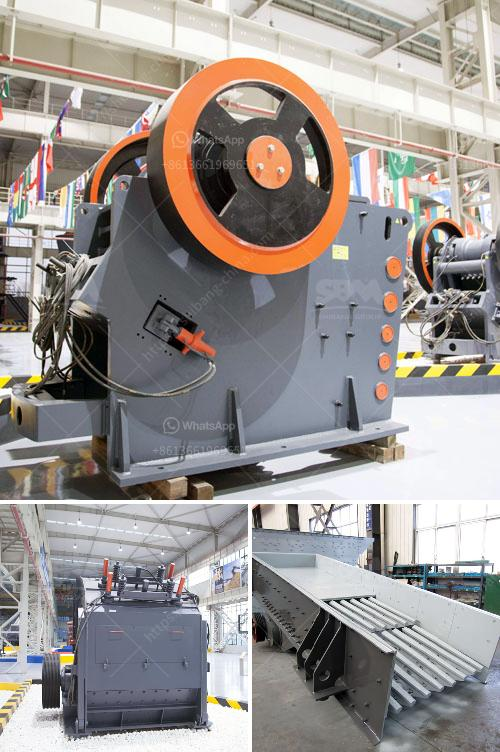

<h3>rock crusher 500 cubic metre per day</h3>
Rock Crusher 500 Cubic Metre Per Day: A crucial aspect in any construction or mining business is the efficiency of the machinery used, as it significantly reduces the cost per cubic meter of materials required. While almost all businesses understand this key aspect, there still remain challenges faced regarding the selection of machinery that offers the best output. One such challenge is selecting a rock crusher capable of producing 500 cubic meters of high-quality aggregate per day. 

To meet this challenge, a reliable and efficient rock crusher is an essential part of any construction or mining business endeavor. Unfortunately, finding a suitable rock crusher can prove to be a herculean task, as there are numerous manufacturers and models available on the market. This article aims to provide an overview of a rock crusher capable of producing 500 cubic meters per day.

First and foremost, the capacity of the rock crusher plays a vital role in determining its suitability for the intended application. In this case, a rock crusher with a capacity of producing 500 cubic meters per day is required to meet the progressive demand of the construction project. Anything less than that would result in insufficient output, leading to project delays and increased costs.

Furthermore, the rock crusher's power source is another important consideration. A powerful engine, coupled with an efficient transmission system, ensures smooth and continuous operation of the crusher. It ensures that the machine can handle the heavy workload without experiencing breakdowns or performance issues.

Additionally, the rock crusher's crushing mechanism should be efficient enough to crush the rock into desired sizes with minimal power consumption. An optimal crushing mechanism ensures that the aggregate material is crushed with precision, resulting in high-quality output. This is crucial, as the quality of the aggregate directly impacts the final product's strength and durability.

Moreover, the rock crusher should have a user-friendly interface, allowing the operator to easily control and monitor the machine. Additionally, it should have proper safety mechanisms in place to prevent accidents or injuries during operation. Safety features like emergency stop buttons, safety guards, and proper training materials contribute to a safe working environment.

Lastly, the rock crusher should be reliable and durable, capable of withstanding the rigors of continuous operation in harsh environments. Construction or mining sites can be challenging, with dust, dirt, and vibrations posing potential risks to the machine. Therefore, selecting a rock crusher built with robust materials and components is imperative to ensure its longevity and reliability.

In conclusion, finding a rock crusher that can produce 500 cubic meters per day is crucial for any construction or mining business undertaking. It is essential to balance the capacity, power source, crushing mechanism, user-friendliness, safety features, and reliability of the machine. Investing in a reliable and efficient rock crusher will lead to increased productivity, reduced costs, and overall success in the construction or mining project.
<h3>Contact us</h3><ul><li><strong>Whatsapp:&nbsp;<a href="https://wa.me/8613661969651">+8613661969651</a></strong></li><li><a href="https://swt.shibang-china.com/?git&amp;zhl&amp;rock crusher 500 cubic metre per day"><strong>Online Service(chat now)</strong></a></li></ul><h3>Related</h3><ul><li><a href='machinery required to extract the platinum.md'>machinery required to extract the platinum</a></li><li><a href='types of conveyors belts.md'>types of conveyors belts</a></li><li><a href='mining process of mica crusher.md'>mining process of mica crusher</a></li><li><a href='used concrete crushing plant for sale in uae.md'>used concrete crushing plant for sale in uae</a></li><li><a href='differences between jaw and gyratory crushers.md'>differences between jaw and gyratory crushers</a></li></ul>