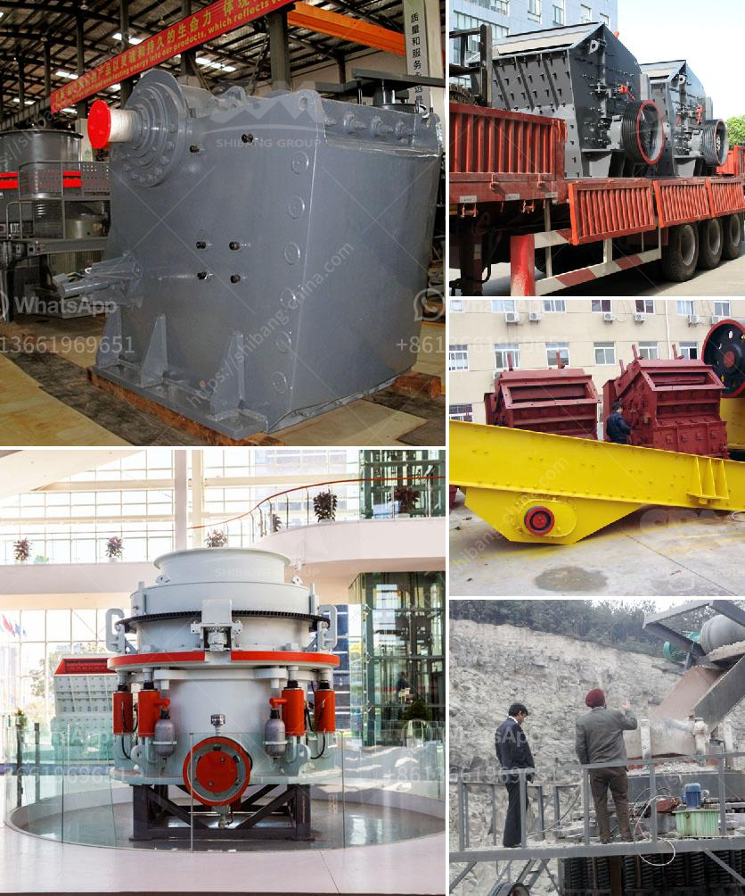

<h3>rock crusher for sale</h3>
Rock crushers are machines used to break rocks and reduce them into smaller sizes. They are used in many industries including mining, construction, and even recycling. There are many types of rock crushers for sale available in the market: jaw crushers, impact crushers, cone crushers, and more. The key to finding the perfect rock crusher for sale is to carefully consider your needs and budget. In this article, we will discuss the different types of rock crushers available and provide you with important tips to find the best rock crusher for sale.

One of the most popular types of rock crushers for sale is the jaw crusher. Jaw crushers are often used in the first stage of the material reduction process, making them especially useful for breaking down large rocks. The jaw crusher has a fixed jaw and a moving jaw, which move together to crush the rocks. This type of crusher is known for its reliability and durability, making it a great investment for any rock crushing project.

Another popular type of rock crusher for sale is the impact crusher. Impact crushers are used to crush rocks with high compressive strength, such as granite, limestone, and concrete. The impact chamber contains a rotating rotor with hammers or blow bars that collide with the incoming rocks and break them into smaller pieces. This type of crusher is known for its high production capacity and excellent particle shape.

Cone crushers are also commonly used in the rock crushing industry. They are similar to gyratory crushers in that they have a mantle that rotates within a concave bowl. The rocks are crushed between the mantle and the bowl liner, resulting in a finer product. Cone crushers are known for their efficiency and versatility, making them a popular choice for many rock crushing applications.

When looking for a rock crusher for sale, there are a few important factors to consider. First, you need to determine the type of rock crusher that best suits your needs. Consider the size of the rocks you will be crushing, as well as the desired end product size. It is also important to consider the production capacity and power requirements of the crusher. Additionally, you should choose a reputable crusher company that offers reliable and efficient machines.

One of the best crusher companies in the market is XYZ Rock Crushers. XYZ has been in the industry for over 50 years, providing high-quality rock crushing equipment to customers worldwide. They offer a wide range of rock crushers for sale, including jaw crushers, impact crushers, and cone crushers. XYZ is known for their commitment to customer satisfaction, offering excellent after-sales service and support.

In conclusion, finding the perfect rock crusher for sale requires careful consideration of your needs and budget. Whether you are in the mining, construction, or recycling industry, there is a rock crusher available for you. Consider the type of crusher that best suits your needs, and choose a reputable company like XYZ Rock Crushers. With their high-quality machines and excellent customer service, you can be confident that you are making a sound investment. Happy rock crushing!
<h3>Contact us</h3><ul><li><strong>Whatsapp:&nbsp;<a href="https://wa.me/8613661969651">+8613661969651</a></strong></li><li><a href="https://swt.shibang-china.com/?git&amp;zhl&amp;rock crusher for sale"><strong>Online Service(chat now)</strong></a></li></ul><h3>Related</h3><ul><li><a href='fuel consumption of stone crushers.md'>fuel consumption of stone crushers</a></li><li><a href='ball mill price supplier.md'>ball mill price supplier</a></li><li><a href='used ball mill for sale india.md'>used ball mill for sale india</a></li><li><a href='vertical grinder mill for sale.md'>vertical grinder mill for sale</a></li><li><a href='vibrating vibrating grizzly feeder capacity.md'>vibrating vibrating grizzly feeder capacity</a></li></ul>