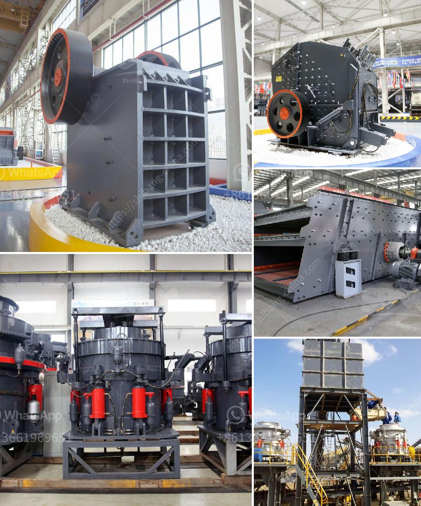

<h3>rock crusher plans</h3>
Rock crushers are essential equipment in mining, construction, and recycling operations. They break down large rocks into smaller pieces for further processing or disposal. Whether you're a professional or a DIY enthusiast, having rock crusher plans can be highly beneficial. These plans outline the steps to build a rock crusher from scratch, using commonly available materials and tools.

One key component of a rock crusher is a drive mechanism, which sets the motion of the crushing mechanism in motion. It consists of a motor, pulley system, and belts. Once powered, the drive system provides the necessary torque to make the crushing jaws move in an oscillating motion, crushing the rocks against the stationary jaw plates.

Once you gather all the required materials and tools, you can follow these basic steps to build your rock crusher:

Rock crushers can be customized to suit different requirements. For example, you can adjust the size of the crushing jaws to accommodate different sizes of rocks. Additionally, you can also add an optional dust collection system to minimize the amount of dust released during the crushing process.

Having rock crusher plans is an excellent way to ensure that your DIY project runs smoothly and efficiently. By following these plans, you can build a sturdy and functional rock crusher that will serve you for years to come. So, gather your materials, get your tools ready, and start building your rock crusher today!
<h3>Contact us</h3><ul><li><strong>Whatsapp:&nbsp;<a href="https://wa.me/8613661969651">+8613661969651</a></strong></li><li><a href="https://swt.shibang-china.com/?git&amp;zhl&amp;rock crusher plans"><strong>Online Service(chat now)</strong></a></li></ul><h3>Related</h3><ul><li><a href='super orion ball mill for mael powder.md'>super orion ball mill for mael powder</a></li><li><a href='ball mill grinding micronizer.md'>ball mill grinding micronizer</a></li><li><a href='stone crusher equipment.md'>stone crusher equipment</a></li><li><a href='sand and gravel suppliers located in cebu.md'>sand and gravel suppliers located in cebu</a></li><li><a href='top 10 stone crusher companies in india.md'>top 10 stone crusher companies in india</a></li></ul>