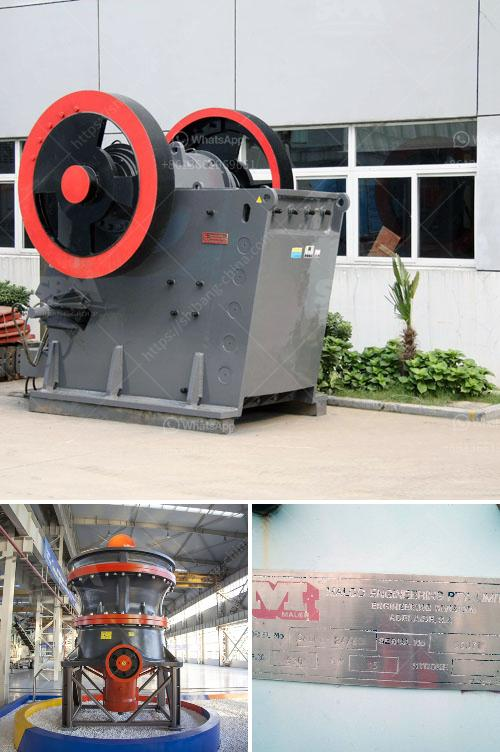

<h3>rock crusher plants in germany</h3>
Rock crusher plants are essential elements in stone quarrying and mining operations all around the world. Used extensively, they provide significant cost savings to businesses by reducing the amount of raw material that needs to be processed into smaller, more manageable sizes. These plants, often referred to as crushing plants, have been an integral part of the construction industry for several decades.

Germany, the birthplace of renowned inventors and engineers, is no stranger to the rock crushing industry. In fact, the country has a long history of producing some of the most innovative crushing plants in the world. From the early days of mining to modern technology advancements, Germany has remained a global leader in the rock crushing industry.

German rock crusher plants come in different sizes and specifications. They are built to meet specific demands and cater to various mining conditions. From mining projects to construction and demolition sites, these plants can process thousands of tons of material every day. Their robust design ensures maximum productivity and efficiency while minimizing downtime and maintenance costs.

One of the key features of German rock crusher plants is their ability to handle a wide range of materials. They are equipped with versatile crushing chambers that can accommodate a variety of feed sizes and produce different end products. This flexibility allows businesses to adapt to changing market demands and produce the required product specifications.

In addition to their versatility, German rock crusher plants are known for their durability and longevity. They are designed to withstand harsh operating conditions and last for many years with proper maintenance. German engineering expertise ensures that these plants are built with high-quality materials and components, making them reliable and efficient.

Germany's commitment to environmental sustainability is evident in the rock crusher plants produced by their manufacturers. These plants are designed to minimize environmental impact through advanced technology and efficient dust suppression systems. They comply with rigorous emission standards, helping businesses operate within environmental regulations and contribute to sustainable development.

Another significant advantage of German rock crusher plants is their integration with other equipment. They can be combined with screens, conveyors, and feeders to create a complete crushing and screening operation. This integration optimizes the overall process, reduces transportation costs, and improves overall efficiency.

Furthermore, German manufacturers provide comprehensive after-sales support, ensuring that their customers receive technical assistance, training, and spare parts when needed. This commitment to customer service and satisfaction further adds value to the purchase of rock crusher plants.

In conclusion, German rock crusher plants embody the country's long-standing engineering tradition and commitment to quality. With their versatility, durability, and environmental sustainability, these plants continue to play a crucial role in various industries worldwide. Whether used in mining, construction, or demolition, these crushing plants provide significant cost savings and productivity improvements. Germany's rock crusher plants are truly a testament to their engineering excellence.
<h3>Contact us</h3><ul><li><strong>Whatsapp:&nbsp;<a href="https://wa.me/8613661969651">+8613661969651</a></strong></li><li><a href="https://swt.shibang-china.com/?git&amp;zhl&amp;rock crusher plants in germany"><strong>Online Service(chat now)</strong></a></li></ul><h3>Related</h3><ul><li><a href='gypsum processing plant.md'>gypsum processing plant</a></li><li><a href='stone crusher machine price for plant.md'>stone crusher machine price for plant</a></li><li><a href='lime powder machine.md'>lime powder machine</a></li><li><a href='ball mills spain.md'>ball mills spain</a></li><li><a href='feldspar stone crushing plant.md'>feldspar stone crushing plant</a></li></ul>