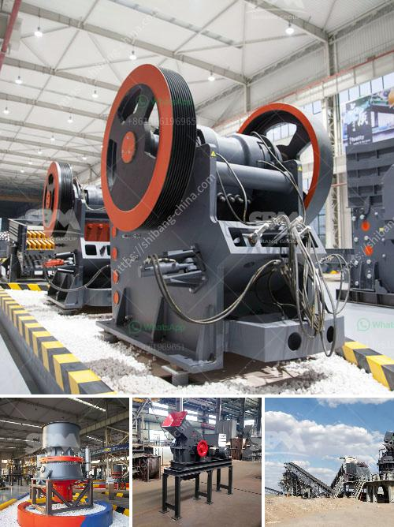

<h3>rock crusher sale</h3>
Rock crushers have been used for decades to break up rocks into smaller, more manageable pieces. Rock crusher sales have been steadily increasing over the past few years, making the market for this type of equipment even more competitive. With so many options to choose from, it can be challenging to find the perfect rock crusher for your needs. However, by understanding the different types of crushers available and their various features, you can make an informed decision and find the right crusher for sale.

One popular option for rock crushing is a jaw crusher. This type of crusher uses a compression force to break up rocks by squeezing them between two plates. It is commonly used in the mining and construction industries due to its ability to crush large rocks into smaller, more manageable sizes. These crushers have a high reduction ratio, meaning they can reduce the size of rocks by up to 3:1.

Another type of rock crusher that is commonly used is a cone crusher. Unlike the jaw crusher, a cone crusher uses a rotating cone to crush rocks instead of squeezing them between two plates. Cone crushers are often used in secondary crushing applications where the desired final product size is larger than what a jaw crusher can produce. They are also used in the mining industry, as they can handle abrasive materials and have a high reduction ratio.

For those looking for a more versatile option, an impact crusher may be the perfect solution. These crushers use a high-speed impact force to break up rocks. They are often used in the recycling and demolition industries, as they can crush a wide range of materials, including concrete and asphalt. Impact crushers are also popular in the mining industry, as they can process materials with a high silica content and achieve a high reduction ratio.

When searching for a rock crusher for sale, it is important to consider the specific needs of your project. Factors such as material type, desired product size, and production rate should all be taken into account. Additionally, it is important to choose a reputable supplier that offers reliable equipment and good customer service.

One company that has developed a strong reputation in the rock crusher industry is XYZ Company. They offer a wide range of rock crushers for sale, including jaw crushers, cone crushers, and impact crushers. All of their equipment is built to withstand the harshest conditions and deliver reliable performance. XYZ Company also provides excellent customer service, offering technical support and spare parts to ensure their customers' satisfaction.

In conclusion, rock crusher sales have been on the rise due to their ability to break up large rocks into smaller, more manageable sizes. There are several types of rock crushers available, including jaw crushers, cone crushers, and impact crushers. When looking for a rock crusher for sale, it is important to consider the specific needs of your project and choose a reputable supplier. XYZ Company is a trusted industry leader that offers a wide range of rock crushers and excellent customer service.
<h3>Contact us</h3><ul><li><strong>Whatsapp:&nbsp;<a href="https://wa.me/8613661969651">+8613661969651</a></strong></li><li><a href="https://swt.shibang-china.com/?git&amp;zhl&amp;rock crusher sale"><strong>Online Service(chat now)</strong></a></li></ul><h3>Related</h3><ul><li><a href='cone crushers for sale in philippines.md'>cone crushers for sale in philippines</a></li><li><a href='design drawing of hopper for crusher.md'>design drawing of hopper for crusher</a></li><li><a href='ballast crushing machine in kenya.md'>ballast crushing machine in kenya</a></li><li><a href='gold stone crusher machine south africa.md'>gold stone crusher machine south africa</a></li><li><a href='calcium carbonate crushing machinery.md'>calcium carbonate crushing machinery</a></li></ul>