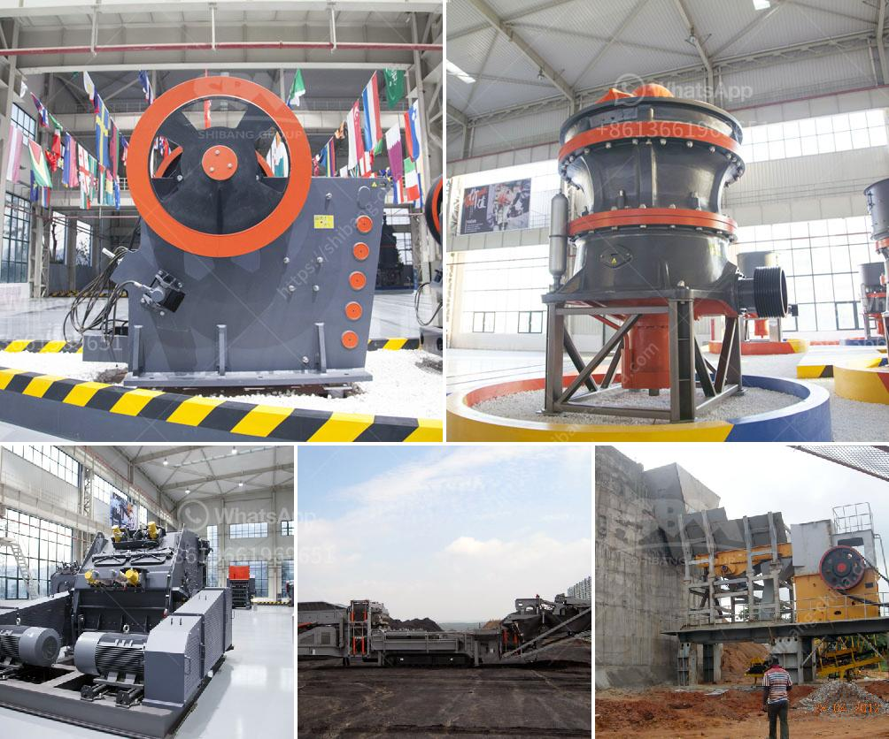

<h3>rock crushing cone</h3>
When it comes to crushing hard rocks, nothing gets the job done better than a rock crushing cone. This powerful piece of equipment is specially designed to break down rocks of various sizes into smaller, more manageable pieces. Whether you're in the mining, construction, or demolition industry, a rock crushing cone is an essential tool that offers efficiency, versatility, and reliability.

One of the key features of a rock crushing cone is its efficient crushing action. The cone-shaped head rotates and exerts immense pressure on the rock, gradually breaking it down into smaller fragments. This process ensures that all the rocks are evenly crushed and reduces the risk of oversized or unevenly crushed materials.

Another advantage of a rock crushing cone is its versatility. It can handle a wide range of materials, from soft limestone to hard granite and everything in between. This versatility allows contractors and operators to tackle various projects without the need for multiple crushers. With just one piece of equipment, they can crush rocks of different sizes and compositions, saving both time and money.

Reliability is also a crucial factor when it comes to choosing a rock crushing cone. These heavy-duty machines are built to withstand the toughest working conditions and are highly durable. They are equipped with robust components that ensure long-lasting performance, reducing the need for frequent maintenance or expensive repairs. This reliability allows operators to focus on their tasks without worrying about equipment breakdowns.

In conclusion, a rock crushing cone is a game-changer for anyone dealing with hard rocks. Its efficient crushing action, versatility, and reliability make it an indispensable tool for various industries. Investing in a rock crushing cone will not only improve productivity but also help save time, money, and effort in the long run. Whether it's breaking rocks for construction projects or extracting minerals from mines, a rock crushing cone is the ultimate solution that ensures optimal results.
<h3>Contact us</h3><ul><li><strong>Whatsapp:&nbsp;<a href="https://wa.me/8613661969651">+8613661969651</a></strong></li><li><a href="https://swt.shibang-china.com/?git&amp;zhl&amp;rock crushing cone"><strong>Online Service(chat now)</strong></a></li></ul><h3>Related</h3><ul><li><a href='crusher stone plant limpopo.md'>crusher stone plant limpopo</a></li><li><a href='crusher manufacturer in pune ie.md'>crusher manufacturer in pune ie</a></li><li><a href='washing plant mining prices.md'>washing plant mining prices</a></li><li><a href='basalt production process.md'>basalt production process</a></li><li><a href='jaw crusher capacity.md'>jaw crusher capacity</a></li></ul>