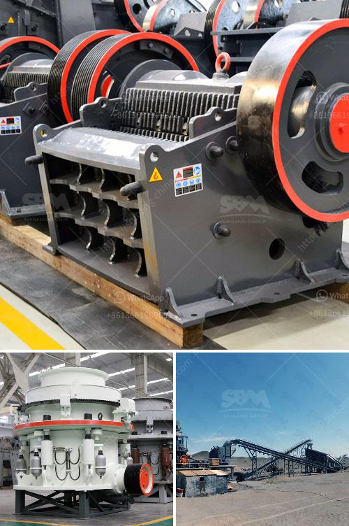

<h3>rock crushing kenya</h3>
Kenya, a growing East African economy, has seen an increase in infrastructure development and construction in recent years. With a surge in demand for building materials, the need for rock crushing machinery is on the rise. Rock crushing is an integral part of the construction industry as it provides the essential aggregates needed for concrete production, road construction, and various other applications.

There are several key reasons for the growth of rock crushing in Kenya. Firstly, the government's commitment to infrastructure development has led to the construction of roads, bridges, and buildings across the country. This has created a strong demand for quality aggregates, which can only be produced through rock crushing.

Secondly, the expansion of urban areas and increasing population has fueled the need for housing and commercial properties. This has led to a rise in construction activities, further driving the demand for rock crushing machinery.

Furthermore, the availability of vast deposits of different rock types in Kenya has made rock crushing a feasible and profitable venture. These deposits include limestone, granite, basalt, and sandstone, which are all crucial components in various construction projects.

Rock crushing in Kenya has not only contributed to the growth of the construction industry but also provided employment opportunities. The establishment of rock crushing companies has led to the creation of jobs for skilled and semi-skilled individuals involved in the operation and maintenance of crushing plants.

Moreover, the ease of accessibility to rock crushing machinery and equipment has played a significant role in its growth. Local and international manufacturers have recognized the potential in the Kenyan market and have been supplying rock crushing machinery tailored to meet the country's specific needs.

In conclusion, rock crushing in Kenya has witnessed a steady rise due to the increasing construction activities and government's commitment to infrastructure development. The availability of diverse rock deposits and the growth of urban areas have further fueled this upward trend. As Kenya continues to invest in its infrastructure and urban development plans, the demand for rock crushing will likely continue to rise in the foreseeable future, making it a lucrative industry to be in.
<h3>Contact us</h3><ul><li><strong>Whatsapp:&nbsp;<a href="https://wa.me/8613661969651">+8613661969651</a></strong></li><li><a href="https://swt.shibang-china.com/?git&amp;zhl&amp;rock crushing kenya"><strong>Online Service(chat now)</strong></a></li></ul><h3>Related</h3><ul><li><a href='crusher for pozzolana.md'>crusher for pozzolana</a></li><li><a href='quartz ball mills hyderabad.md'>quartz ball mills hyderabad</a></li><li><a href='cement production machinery.md'>cement production machinery</a></li><li><a href='tonnes aggregate crusher in south africa crusher.md'>tonnes aggregate crusher in south africa crusher</a></li><li><a href='graphite production machinery.md'>graphite production machinery</a></li></ul>