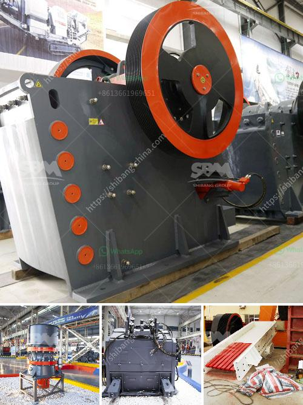

<h3>rock crushing machine suppliers</h3>
In the construction industry, various types of equipment are utilized to carry out different tasks. One particular machine that is essential in any construction project is a rock crushing machine. A rock crushing machine, also known as a cone crusher, is essentially a compression type of machine that reduces rock material by squeezing and compressing the material between a moving piece of steel and a stationary piece of steel.

The size of the final crushed rock material primarily depends on the gap setting between the two pieces of steel. The smaller the gap, the finer the crushed material. This makes rock crushing machines ideal for reducing the size of various types of rocks, including hard and abrasive rocks such as granite, basalt, and quartzite.

As construction companies engage in projects that involve blasting, excavation, and the creation of foundations, there is often a need to crush the extracted rocks into smaller sizes, which can then be used as construction aggregates. Therefore, having access to reliable and efficient rock crushing machines is crucial for construction companies to ensure their projects are completed successfully.

When it comes to sourcing rock crushing machines, construction companies need to find reliable suppliers that can provide quality machines at competitive prices. There are various factors to consider when selecting a supplier, including the following:

1. Quality and reliability: Construction companies must choose suppliers who offer rock crushing machines that are built to last and can withstand heavy-duty use. Reliability is crucial to avoid interruptions in construction projects due to machine breakdowns.

2. Customization options: Every construction project is unique, and the requirements for crushed rock material may vary. Therefore, it is essential to find suppliers who can offer rock crushing machines with customization options to meet specific project needs.

3. Support and maintenance: Rock crushing machines require regular maintenance to ensure optimal performance and longevity. Suppliers who offer comprehensive support and maintenance packages can help construction companies minimize downtime and reduce maintenance costs.

4. Cost-effectiveness: Cost is always a significant aspect to consider when investing in machinery. Construction companies should compare prices and evaluate the overall value offered by different suppliers, considering factors such as quality, customization, and support.

By partnering with reliable rock crushing machine suppliers, construction companies can streamline their operations, increase productivity, and save costs. These machines can process large volumes of rocks quickly, providing construction companies with a steady supply of crushed rock material, which is often used as a base for roads, concrete production, and other construction purposes.

In conclusion, rock crushing machines are essential tools for construction companies, enabling them to convert large rocks into smaller, usable materials for various construction purposes. Investing in reliable and efficient rock crushing machines from reputable suppliers ensures construction projects run smoothly and efficiently while maintaining high-quality standards. With the right supplier, construction companies can enhance their capabilities, meet project requirements, and achieve success in their endeavors.
<h3>Contact us</h3><ul><li><strong>Whatsapp:&nbsp;<a href="https://wa.me/8613661969651">+8613661969651</a></strong></li><li><a href="https://swt.shibang-china.com/?git&amp;zhl&amp;rock crushing machine suppliers"><strong>Online Service(chat now)</strong></a></li></ul><h3>Related</h3><ul><li><a href='coal screening equipment price.md'>coal screening equipment price</a></li><li><a href='philippines stone crusher.md'>philippines stone crusher</a></li><li><a href='mobile crusher india.md'>mobile crusher india</a></li><li><a href='vibrating screen for silica sand.md'>vibrating screen for silica sand</a></li><li><a href='limestone crusher in cement plant for environmental.md'>limestone crusher in cement plant for environmental</a></li></ul>