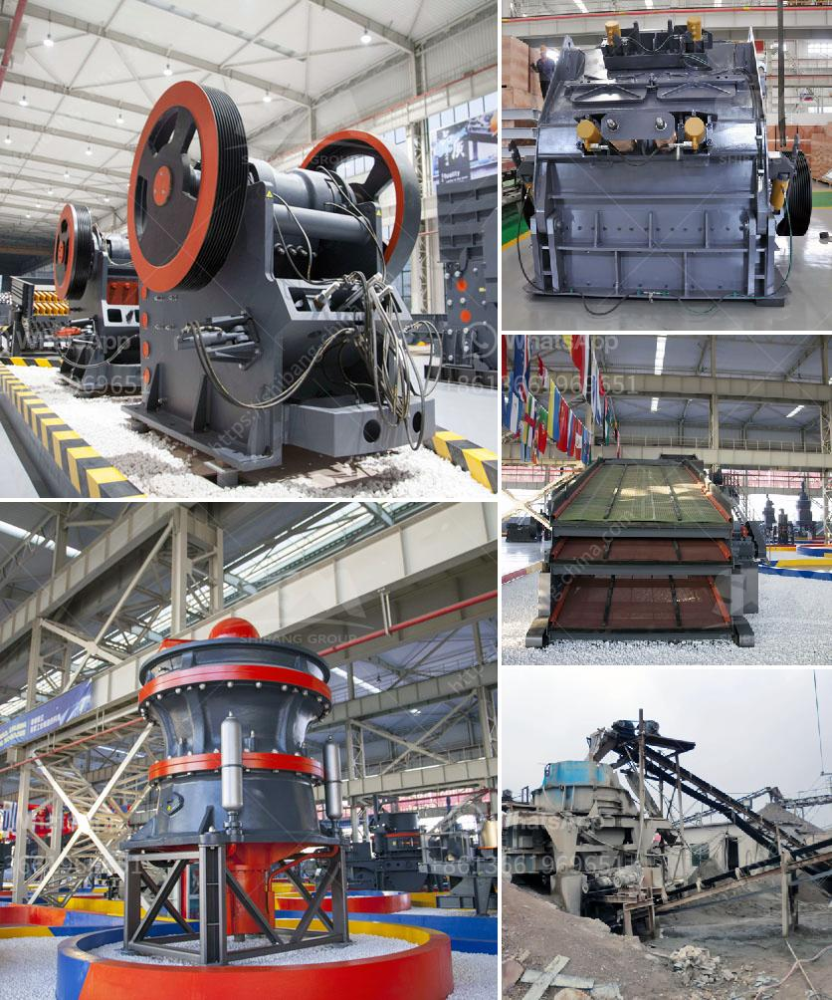

<h3>rock crushing plant for sale</h3>
Rock crushing plant is popular for a variety of reasons. First and foremost, it is an efficient way to process materials for various construction applications. Secondly, the rock crushing plant is versatile in terms of the end products that it produces. Crushed rocks of different sizes are used in road construction, landscaping, and concrete production, among others. Lastly, investing in a rock crushing plant for sale is a profitable endeavor.

One key advantage of a rock crushing plant is its ease of installation. It can be set up and running within a matter of hours, allowing construction projects to proceed without delay. Additionally, these plants are highly customizable, enabling owners to fine-tune the equipment to meet specific production requirements.

Another benefit is the cost-effective nature of rock crushing plants. Once installed, they require minimum maintenance and have a long lifespan, ensuring a high return on investment. Furthermore, they reduce the need for manual labor, resulting in lower operating costs.

When choosing a rock crushing plant for sale, it is important to consider factors such as the capacity, power consumption, and the final product size. Assessing these aspects will help you determine the most suitable plant for your needs.

There are various types of rock crushing plants available, including jaw crushers, impact crushers, and cone crushers. Each type has its own unique features and advantages. For instance, jaw crushers are ideal for primary crushing, while cone crushers are better suited for secondary or tertiary crushing.

In conclusion, a rock crushing plant for sale is an investment worth considering. It offers several advantages, including efficient material processing, versatility in end product production, and cost-effectiveness. With a wide range of options available, finding the right plant for your needs is now easier than ever. Choose wisely and reap the benefits of owning a rock crushing plant.
<h3>Contact us</h3><ul><li><strong>Whatsapp:&nbsp;<a href="https://wa.me/8613661969651">+8613661969651</a></strong></li><li><a href="https://swt.shibang-china.com/?git&amp;zhl&amp;rock crushing plant for sale"><strong>Online Service(chat now)</strong></a></li></ul><h3>Related</h3><ul><li><a href='small scale gold mining equipment in south africa.md'>small scale gold mining equipment in south africa</a></li><li><a href='industrial crusher machine.md'>industrial crusher machine</a></li><li><a href='feldspar stone for sale india.md'>feldspar stone for sale india</a></li><li><a href='calcium carbonate powder processing plant.md'>calcium carbonate powder processing plant</a></li><li><a href='quarry crusher machine price.md'>quarry crusher machine price</a></li></ul>