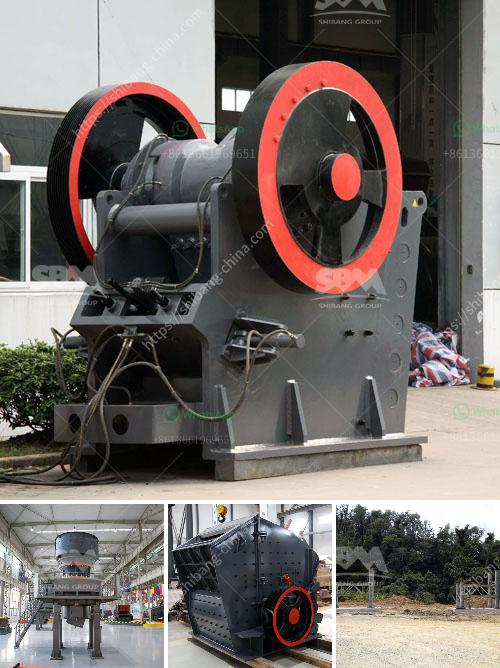

<h3>rock stone crushing machine in usa</h3>
The rock stone crushing machine is an essential equipment for mining and quarrying. It is equipped with a hydraulic pressure system which makes it very convenient to move and install. Rock stone crushing machines have various modes of operation, such as jaw crusher, impact crusher, cone crusher, hammer crusher, and so on. They are typically used when rocks are too hard or too large to be broken down by traditional crushing equipment.

In the United States, there are many suppliers and manufacturers of rock stone crushing machines. Some of the leading manufacturers include Metso, Sandvik, Terex, and Komatsu. They offer a wide range of machines for various applications, such as rock crushing for construction, mining, and quarrying.

One of the popular machines in this category is the jaw crusher. It is widely used in the mining and construction industry due to its ability to crush large pieces of rock into smaller ones. The jaw crusher consists of two vertical jaws which are further apart at the top than at the bottom. One jaw is fixed while the other moves back and forth to crush the rock. This machine is capable of producing a wide range of particle sizes, making it suitable for various applications.

Another widely used machine is the impact crusher. It utilizes the impact force to crush the rocks and is suitable for both soft and hard materials. The impact crusher consists of a rotor that revolves at high speed and a crushing chamber that contains a rotating hammer or impact bar. When the rock enters the chamber, it is struck by the hammer or impact bar and is shattered into smaller pieces.

In addition to jaw and impact crushers, other machines like cone crushers and hammer crushers are also commonly used in the United States. Cone crushers are used for crushing rocks into smaller sizes by crushing them between a mantle and a concave. Hammer crushers, on the other hand, use a series of hammers to crush the rocks. They are particularly suitable for crushing brittle materials.

The rock stone crushing machines in the United States are designed to handle a wide range of materials, including limestone, shale, granite, and sandstone. They are used for various purposes, such as crushing rocks for road construction, building materials, cement production, and landscaping. The machines are also used in the mining industry to extract valuable minerals from the rocks.

Overall, the rock stone crushing machines in the United States are essential equipment for various industries. They provide a cost-effective and efficient way to crush rocks into smaller sizes for further processing. With the advancement in technology, these machines are constantly improving in terms of performance and productivity. As a result, they are becoming more popular and widely used in the mining and construction industry in the United States.
<h3>Contact us</h3><ul><li><strong>Whatsapp:&nbsp;<a href="https://wa.me/8613661969651">+8613661969651</a></strong></li><li><a href="https://swt.shibang-china.com/?git&amp;zhl&amp;rock stone crushing machine in usa"><strong>Online Service(chat now)</strong></a></li></ul><h3>Related</h3><ul><li><a href='drywall grinding for gypsum.md'>drywall grinding for gypsum</a></li><li><a href='jaw crusher for sale south africa.md'>jaw crusher for sale south africa</a></li><li><a href='portable stone crusher for sale india price.md'>portable stone crusher for sale india price</a></li><li><a href='africa sand washing plant for rent and sale.md'>africa sand washing plant for rent and sale</a></li><li><a href='manganese ore sintering process.md'>manganese ore sintering process</a></li></ul>