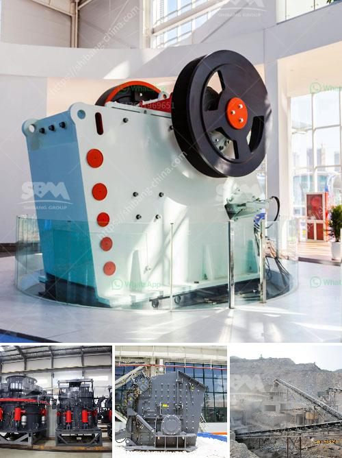

<h3>roller crusher china</h3>
Roller Crusher China is a professional roller crusher manufacturer in China. We offer high-quality roller crusher and the best service to our clients. We pride ourselves in our commitment and the level of service offered and aim to work closely with customers, to ensure we meet your expectations. Our focus is always on providing you with innovative solutions, the latest technology, and the best service in the industry.

Roller crusher is a compression-based crusher that is widely used in the industry for crushing and compacting various material. It is widely used for crushing materials such as coal, rock, coke, and other hard materials. Roller crusher has the advantages of simple structure, easy maintenance, low cost, and high efficiency. It is mainly used in industries such as cement, coal preparation, power generation, chemical industry, and building materials.

One of the key benefits of roller crusher China is the ability to crush materials into a uniform particle size. This ensures that all the particles are evenly distributed, which is essential for a variety of applications. Whether you are producing cement, looking for a cost-effective solution for coal preparation, or need to crush materials for chemical processes, roller crusher China can provide the perfect solution.

Another advantage of roller crusher China is its durability. Roller crushers are typically designed to withstand heavy usage and to have a long lifespan. This is important in industries where the crushing process is continuous and there is a high demand for crushed materials. Roller crusher China is built to last, ensuring that you get value for your investment and can continue to produce high-quality products.

In addition to its durability, roller crusher China offers several other benefits. It has a compact design, which means it can easily fit into tight spaces. It is also easy to install and operate, making it a convenient solution for any manufacturing facility. Furthermore, roller crusher China is designed with safety in mind. It is equipped with advanced safety features to protect the operator and prevent accidents.

If you are in the market for a roller crusher China, it is crucial to choose a reputable manufacturer. Roller Crusher China has a proven track record of providing high-quality products and exceptional service. We have a team of experienced engineers who can guide you through the selection process and help you choose the right crusher for your specific needs. Whether you need a single roller crusher or a complete crushing and screening system, we have the expertise to deliver.

In conclusion, roller crusher China offers a reliable and cost-effective solution for crushing materials in various industries. With its durable construction, compact design, and advanced safety features, roller crusher China is an ideal choice for any manufacturing facility. As a leading roller crusher manufacturer in China, we are committed to providing the best products and service to our customers. Contact us today to discuss your requirements and let us help you find the perfect roller crusher for your business.
<h3>Contact us</h3><ul><li><strong>Whatsapp:&nbsp;<a href="https://wa.me/8613661969651">+8613661969651</a></strong></li><li><a href="https://swt.shibang-china.com/?git&amp;zhl&amp;roller crusher china"><strong>Online Service(chat now)</strong></a></li></ul><h3>Related</h3><ul><li><a href='list of the price of crushing plant turkey.md'>list of the price of crushing plant turkey</a></li><li><a href='caterpillar stone crusher.md'>caterpillar stone crusher</a></li><li><a href='impact crusher price list.md'>impact crusher price list</a></li><li><a href='crusher for sale kenya.md'>crusher for sale kenya</a></li><li><a href='mobile crusher for.md'>mobile crusher for</a></li></ul>