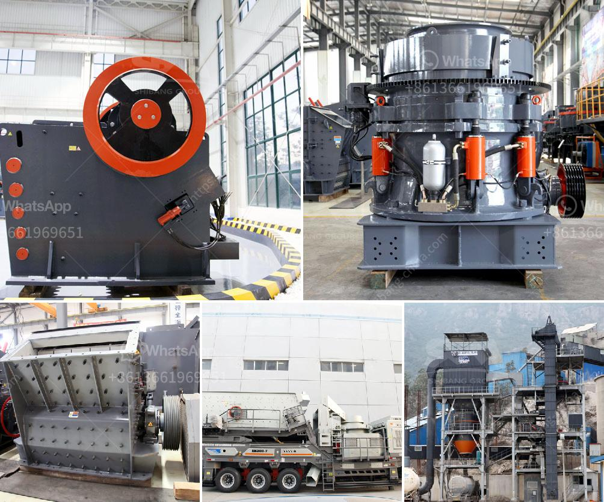

<h3>roller crusher on sale</h3>
Roller crushers are commonly used in various industries, including mining, construction, and recycling. They are widely appreciated for their high efficiency, easy operation, and low maintenance. If you are in the market for a roller crusher, you are in luck. Many suppliers are offering roller crushers on sale, making it an opportune time to invest in this versatile machine. This article provides a comprehensive guide to roller crushers on sale, exploring their advantages, applications, and key considerations when purchasing.

1. High Efficiency: Roller crushers are known for their exceptional efficiency when it comes to crushing materials. The double-roll design is particularly effective in breaking down large particles into smaller sizes. The two rolls rotate towards each other, exerting pressure on the material, which is then crushed between them.

2. Easy Operation: Roller crushers are relatively simple to operate. With a basic control panel, operators can adjust the gap between the rolls, controlling the size of the final product. Additionally, some models come with automatic features, such as overload protection and automatic lubrication, enhancing ease of use.

3. Low Maintenance: Roller crushers are designed to withstand heavy-duty use, minimizing the need for frequent maintenance. The robust construction and quality components ensure durability, reducing downtime and overall operating costs.

1. Mining: Roller crushers are extensively used in the mining industry to crush minerals and hard materials. They are ideal for secondary and tertiary crushing stages, as they produce a uniform product size and have the ability to handle high capacity.

2. Construction: Roller crushers have found their application in the construction industry, where they are used to crush aggregates for concrete production. They can efficiently process different types of materials, ranging from limestone to granite, ensuring consistent quality in the final product.

3. Recycling: Roller crushers are also commonly used in recycling operations, where they are utilized to crush various types of waste materials, such as asphalt, concrete, and brick. The ability to crush and recycle such materials enhances sustainability and reduces the environmental impact of waste disposal.

1. Capacity: Determine your required crushing capacity to ensure the roller crusher you choose can handle the necessary workload. Consider the average feed size, desired product size, and the expected production rate.

2. Durability: Look for a roller crusher that is built to last. Opt for models constructed with high-quality materials and components to ensure long-term performance and minimize maintenance requirements.

3. After-Sales Support: Research the supplier's reputation for providing excellent after-sales support, including technical assistance, spare parts availability, and warranty terms. A reliable supplier will be able to provide prompt and efficient assistance whenever needed.

In conclusion, roller crushers on sale present an excellent opportunity for businesses across various industries to enhance their productivity and efficiency. With their high efficiency, ease of operation, and low maintenance, roller crushers are a valuable investment. Consider your specific requirements, applications, and the reputation of the supplier when making a purchase. By doing so, you can ensure that you find a roller crusher that suits your needs perfectly, adding value to your operations for years to come.
<h3>Contact us</h3><ul><li><strong>Whatsapp:&nbsp;<a href="https://wa.me/8613661969651">+8613661969651</a></strong></li><li><a href="https://swt.shibang-china.com/?git&amp;zhl&amp;roller crusher on sale"><strong>Online Service(chat now)</strong></a></li></ul><h3>Related</h3><ul><li><a href='mobile crusher on rent for iron ore.md'>mobile crusher on rent for iron ore</a></li><li><a href='price on a jaw crusher in south africa.md'>price on a jaw crusher in south africa</a></li><li><a href='roller mill price.md'>roller mill price</a></li><li><a href='jaw crusher supplier of new zealand.md'>jaw crusher supplier of new zealand</a></li><li><a href='calcium carbonate powder processing plant.md'>calcium carbonate powder processing plant</a></li></ul>