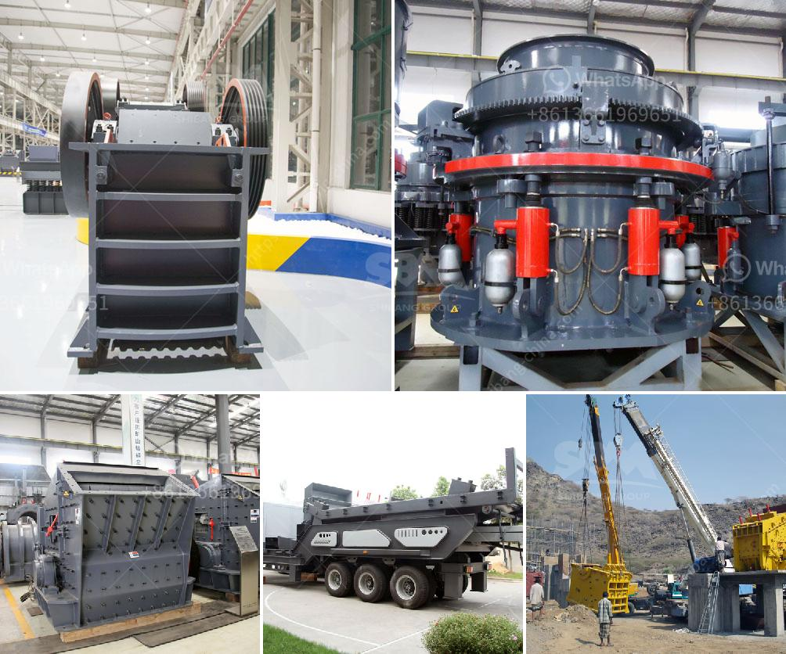

<h3>roller mill in china</h3>
Roller mills have been widely used in China for centuries, and they continue to be an essential tool in the milling industry. With their ability to produce high-quality flours, roller mills play a crucial role in meeting the ever-increasing demand for grain-based products.

One of the primary advantages of roller mills is their ability to efficiently grind various grains, such as wheat, corn, rice, and barley. These machines work by crushing the grains between a series of rotating rollers, resulting in finely ground flour. Compared to traditional stone mills, roller mills offer a more consistent grind, allowing for greater control over the final texture of the flour.

China, being one of the largest agricultural nations, has a strong reliance on roller mills. The country's rapidly growing population demands a consistent supply of staple products, such as rice and wheat flour. Roller mills address this need by providing a reliable and efficient method for milling large quantities of grains.

In recent years, Chinese roller mill manufacturers have made significant advancements in design and technology. These developments have led to roller mills that are more energy-efficient and produce higher quality flours. Many Chinese roller mills have also integrated automation and digital controls, allowing for precise adjustments and reducing the need for manual labor.

Furthermore, roller mills in China have been designed to be flexible and versatile, capable of processing different types of grains and adapting to varying milling requirements. This adaptability is crucial as it enables millers to respond to changing market demands.

Despite their numerous benefits, roller mills in China still face challenges. The rising costs of raw materials, such as steel and electricity, pose financial burdens on millers. Additionally, the rapidly expanding urban areas in China often lead to mills being relocated or shut down, creating logistical issues for the industry.

Overall, roller mills are a vital component of the milling industry in China. With ongoing technological advancements and a commitment to meeting the growing demand for grain-based products, roller mills continue to play a crucial role in ensuring a stable food supply for the nation's population.
<h3>Contact us</h3><ul><li><strong>Whatsapp:&nbsp;<a href="https://wa.me/8613661969651">+8613661969651</a></strong></li><li><a href="https://swt.shibang-china.com/?git&amp;zhl&amp;roller mill in china"><strong>Online Service(chat now)</strong></a></li></ul><h3>Related</h3><ul><li><a href='quarry equipment suppliers miami.md'>quarry equipment suppliers miami</a></li><li><a href='feasiblity study of a fero chrome crushing plant.md'>feasiblity study of a fero chrome crushing plant</a></li><li><a href='mini cement plant grinding project report.md'>mini cement plant grinding project report</a></li><li><a href='design of a barite grinding mill.md'>design of a barite grinding mill</a></li><li><a href='capacity 1 to 5 tons per hour price.md'>capacity 1 to 5 tons per hour price</a></li></ul>