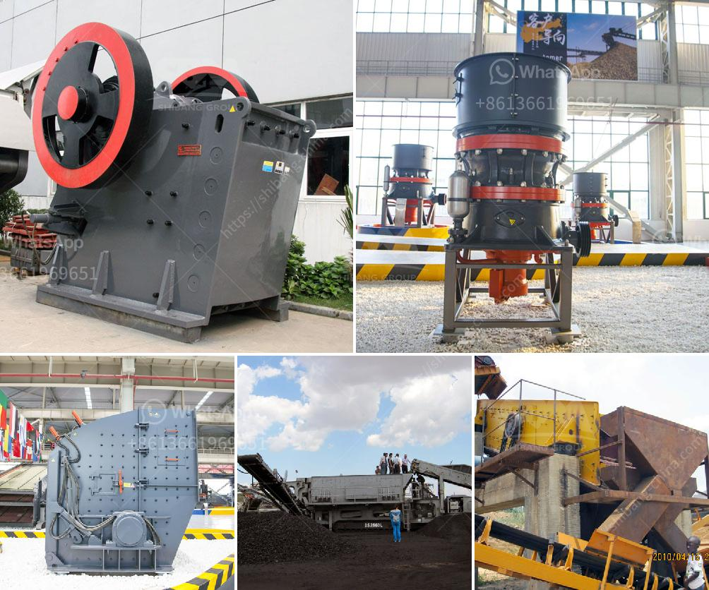

<h3>roller mill price</h3>
The roller mill is an essential piece of equipment in the industrial milling industry. It is used to grind, crush, or pulverize materials into fine particles. With advancements in technology, roller mills have become more efficient and versatile, offering various benefits to businesses across different sectors. In this article, we will explore the factors that influence roller mill prices and discuss their typical price range.

1. Size and Capacity: Roller mills come in different sizes and capacities, varying from small-scale models suitable for home use to large industrial-grade mills designed for high-volume operations. The size and capacity of a roller mill significantly impact its price. Larger mills with higher capacities tend to be more expensive due to their advanced features and robust construction.

2. Material and Build Quality: The material used in constructing a roller mill affects its price. Roller mills made of high-quality materials, such as stainless steel or alloy steel, are generally more expensive than those made of lower-grade materials. The build quality of a roller mill, including the durability of its components and stability of its frame, also factors into the price.

3. Brand and Reputation: Roller mills from well-established and reputable brands may cost more due to their brand value and customer trust. These manufacturers often have a track record of producing reliable and efficient roller mills. However, it is important to note that lesser-known brands can also offer high-quality roller mills at a more affordable price.

4. Features and Functionality: Roller mills come with various features and functionalities that cater to different milling needs. Some common features include adjustable roll gaps, automated control systems, and easy maintenance. More advanced features usually come at a higher price.

The price of a roller mill can range widely depending on the aforementioned factors. However, a general price range for roller mills suitable for industrial use is between $5,000 and $20,000. This range covers medium to large-scale roller mills with decent specifications, efficiency, and durability.

For smaller roller mills designed for home or small-scale use, the price range generally falls between $1,000 and $5,000. These mills are typically more compact and have lower production capacities compared to their industrial counterparts.

It is important to note that the price mentioned here is just a rough estimate. The actual price may vary depending on specific configurations, additional features, and customizations.

In conclusion, the price of a roller mill is influenced by various factors such as size, capacity, material quality, brand reputation, and features. Understanding these factors is crucial for businesses looking to invest in a roller mill. By considering their milling requirements, budget, and long-term goals, businesses can select a roller mill that strikes the right balance between price and performance. Investing in a quality roller mill is a wise decision as it can enhance productivity, improve product quality, and contribute to long-term cost savings.
<h3>Contact us</h3><ul><li><strong>Whatsapp:&nbsp;<a href="https://wa.me/8613661969651">+8613661969651</a></strong></li><li><a href="https://swt.shibang-china.com/?git&amp;zhl&amp;roller mill price"><strong>Online Service(chat now)</strong></a></li></ul><h3>Related</h3><ul><li><a href='coal machines for sale in south africa.md'>coal machines for sale in south africa</a></li><li><a href='limestone crusher mining equipment.md'>limestone crusher mining equipment</a></li><li><a href='fine powder grinding machine philippines.md'>fine powder grinding machine philippines</a></li><li><a href='chrome beneficiation plant design.md'>chrome beneficiation plant design</a></li><li><a href='gold sand processing technology.md'>gold sand processing technology</a></li></ul>