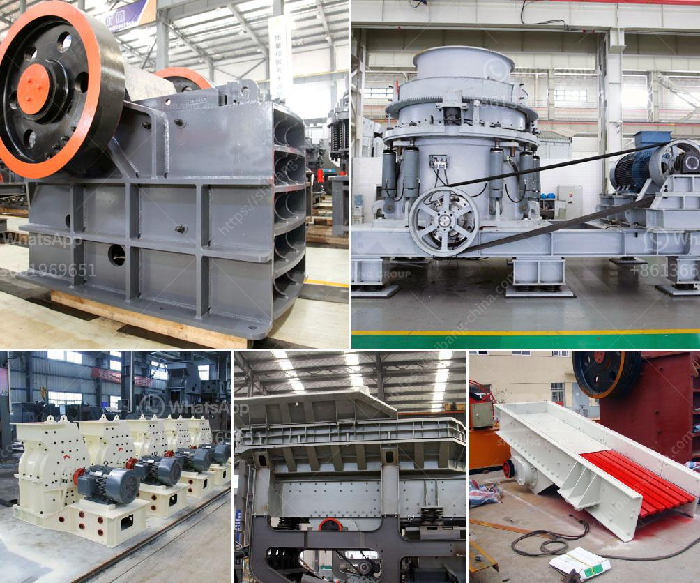

<h3>roller mill working</h3>
A roller mill is a mechanical device that is designed to grind various materials into fine powders. It works by rolling the material between cylindrical rollers, causing them to crush and grind the particles into a smaller, finer size. This process is commonly used in the manufacturing of various types of industries, including food processing, pharmaceuticals, and mining.

The working principle of a roller mill is fairly simple. The material to be ground is fed into the grinding chamber between the rollers. As the rollers rotate, they exert pressure on the material, causing it to be crushed and ground. The ground material is then collected in a collection container at the bottom of the mill.

There are several key components that make up a roller mill. The most important of these are the grinding rollers, which are usually made of hardened steel or cast iron. These rollers are mounted on a shaft and are rotated by a motor. The speed at which the rollers rotate can be adjusted to control the fineness of the grinding process.

Another crucial component of a roller mill is the grinding ring. This is a circular steel plate that is placed around the grinding rollers. The grinding ring has a series of small holes or slots that allow the ground material to escape from the grinding chamber. The size and shape of these holes can be customized to control the size distribution of the ground material.

In addition to the grinding rollers and ring, a roller mill also has a feeding system that supplies the material to be ground. This can be achieved through a gravity feed or a mechanical feed mechanism. The choice of feeding system depends on the type and properties of the material being processed.

The efficiency and effectiveness of a roller mill depend on several factors. Firstly, the quality and hardness of the grinding rollers play a crucial role in the grinding process. Harder rollers can effectively grind tougher materials, while softer rollers may wear out more quickly.

The speed at which the rollers rotate also affects the grinding process. Higher rotation speeds generally result in finer grinding, but it may also lead to increased wear and tear on the rollers. The gap between the rollers and the grinding ring can also be adjusted to control the fineness of the grinding.

Overall, roller mills are an important tool in the manufacturing industry. They allow for the efficient grinding of various materials into fine powders, which can then be further processed or used directly in the desired application. By controlling the feed rate, roller speed, and gap size, manufacturers can achieve the desired grinding results and produce high-quality products.
<h3>Contact us</h3><ul><li><strong>Whatsapp:&nbsp;<a href="https://wa.me/8613661969651">+8613661969651</a></strong></li><li><a href="https://swt.shibang-china.com/?git&amp;zhl&amp;roller mill working"><strong>Online Service(chat now)</strong></a></li></ul><h3>Related</h3><ul><li><a href='grinding grinding equipment grinding.md'>grinding grinding equipment grinding</a></li><li><a href='granite quarry business plan pdf.md'>granite quarry business plan pdf</a></li><li><a href='rent a portable conveyor belt system malaysia.md'>rent a portable conveyor belt system malaysia</a></li><li><a href='used air classifier mills for sale.md'>used air classifier mills for sale</a></li><li><a href='quarry equipment suppliers miami.md'>quarry equipment suppliers miami</a></li></ul>