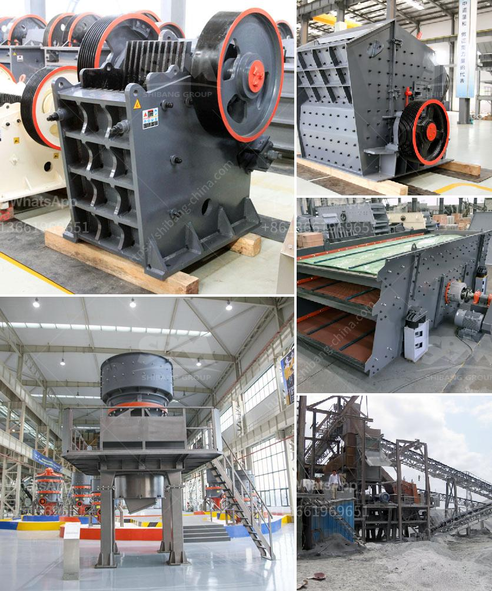

<h3>rotary dryer sales indonesia</h3>
The industrial sector in Indonesia has been growing rapidly in recent years, and this has led to an increased demand for machinery and equipment. Among the machinery that is highly sought after is the rotary dryer, which plays a crucial role in various industrial processes such as drying bulk materials.

A rotary dryer is a type of industrial dryer that utilizes heat to remove moisture from materials. It consists of a rotating drum, also known as a cylinder, which is heated from the inside and the materials are fed into the drum through a feed chute. The rotation of the drum ensures a thorough and even drying process.

Indonesia, being a vast archipelago with diverse natural resources, has a wide range of industries that can benefit from the use of rotary dryers. For instance, the agriculture sector can utilize these machines for drying crops such as rice, coffee, and cocoa. The mining industry can also take advantage of rotary dryers to dry various minerals and ores.

The market for rotary dryers in Indonesia has been steadily growing over the years. This can be attributed to the increasing industrialization in the country, as well as the need for efficient and cost-effective drying solutions. Additionally, the government has been encouraging local industries to adopt advanced technologies and machinery to enhance productivity.

In recent years, several companies have emerged as key players in the rotary dryer industry in Indonesia. These companies offer a wide range of rotary dryers that cater to different industries and drying requirements. They also provide after-sales services, such as installation, maintenance, and technical support, ensuring customer satisfaction.

One of the factors driving the demand for rotary dryers in Indonesia is the need for energy-efficient solutions. Many industries are looking for ways to reduce energy consumption and minimize their carbon footprint. Rotary dryers offer an efficient and eco-friendly drying solution, as they utilize heat from a variety of sources, including gas, electricity, and biomass. Furthermore, modern rotary dryers are equipped with advanced control systems that optimize energy usage and ensure consistent drying performance.

Another factor contributing to the growth of rotary dryer sales in Indonesia is the increasing focus on product quality. As industries strive to maintain high-quality standards, they rely on efficient drying processes to ensure that their products meet the desired specifications. Rotary dryers provide a reliable and controlled drying environment, resulting in consistent and high-quality output.

Furthermore, the growing awareness of the importance of sustainable development has led to increased investments in renewable energy sources. Rotary dryers can be integrated with biomass boilers or other renewable energy systems to provide a sustainable and eco-friendly drying solution. This aligns with the government's initiatives to promote renewable energy usage in industries and reduce reliance on fossil fuels.

In conclusion, the sales of rotary dryers in Indonesia have been witnessing steady growth due to the country's industrial development and the need for efficient drying solutions. The demand for these machines is expected to further increase as industries strive for energy efficiency and high-quality products, while also embracing sustainability. With the presence of key players in the market that offer a range of rotary dryers and comprehensive after-sales services, Indonesia presents promising opportunities for the rotary dryer industry.
<h3>Contact us</h3><ul><li><strong>Whatsapp:&nbsp;<a href="https://wa.me/8613661969651">+8613661969651</a></strong></li><li><a href="https://swt.shibang-china.com/?git&amp;zhl&amp;rotary dryer sales indonesia"><strong>Online Service(chat now)</strong></a></li></ul><h3>Related</h3><ul><li><a href='stone benta stone crusher in parral chihuahua.md'>stone benta stone crusher in parral chihuahua</a></li><li><a href='ball mill grinding micronizer.md'>ball mill grinding micronizer</a></li><li><a href='wet and dry ball mill.md'>wet and dry ball mill</a></li><li><a href='high capacity r ore raymond mill with competitive price.md'>high capacity r ore raymond mill with competitive price</a></li><li><a href='mobile crushers for hire in gauteng south africa.md'>mobile crushers for hire in gauteng south africa</a></li></ul>