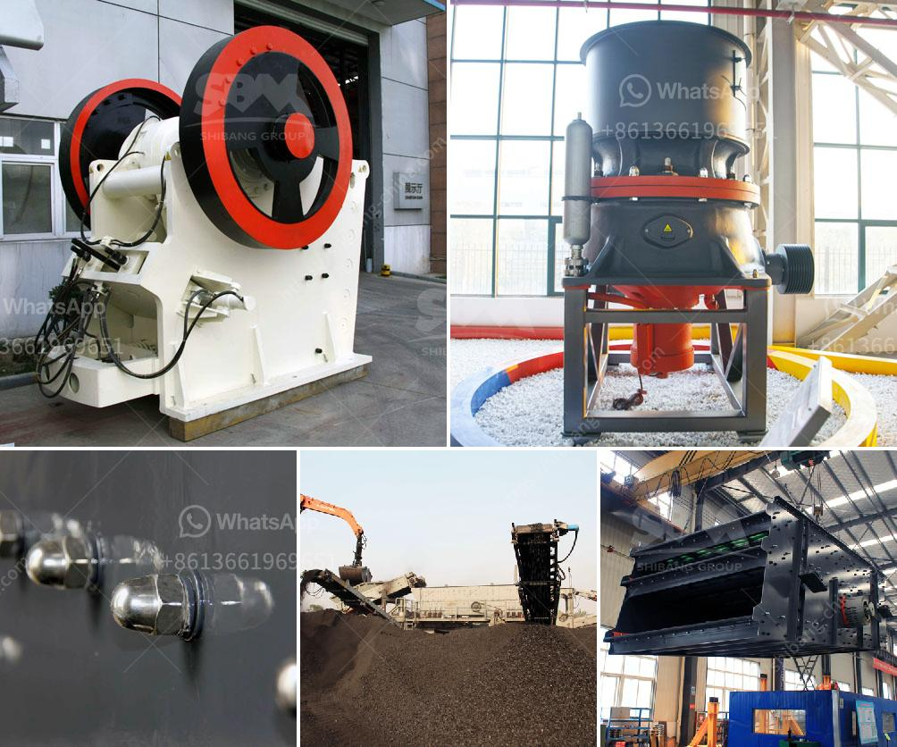

<h3>rotary grinder machine thailand</h3>
Thailand has always been a hub for manufacturing and industrial development. The country's ability to adapt and embrace new technologies has allowed it to thrive in various sectors. One such sector where Thailand has left a significant impact is the grinding industry, thanks to the efficient and cutting-edge rotary grinder machines.

Rotary grinder machines have become the backbone of the grinding industry worldwide. These machines are known for their ability to produce precise and high-quality finishes on different surfaces. Thailand, in particular, has emerged as a leading manufacturer and supplier of these machines, catering to both domestic and international markets.

One of the key factors that has contributed to Thailand's success in this sector is its commitment to innovation. Thai manufacturers have constantly strived to develop rotary grinder machines that offer advanced features, increased efficiency, and improved accuracy. These machines are designed to handle a wide variety of applications, ranging from simple polishing to complex grinding tasks.

The performance of Thai rotary grinder machines is unrivaled. Their robust construction, coupled with state-of-the-art technology, ensures exceptional durability and longevity. These machines are built to withstand heavy workloads, making them ideal for industrial applications that require prolonged usage. Furthermore, their versatility allows for customization to meet specific grinding needs, making them suitable for a wide range of industries, including aerospace, automotive, and general manufacturing.

Precision is a hallmark of rotary grinder machines, and Thai manufacturers excel in providing highly accurate results. These machines are equipped with advanced control systems and software that allow users to adjust and monitor parameters, ensuring consistently sharp and smooth finishes. Whether it's surface grinding, internal grinding, or cylindrical grinding, Thai-made rotary grinder machines guarantee precise outcomes that meet the most demanding industry standards.

In addition to their exceptional performance and precision, Thai rotary grinder machines are also celebrated for their user-friendly nature. Manufacturers understand the importance of ergonomics and ease of operation to enhance productivity. Therefore, these machines are designed with intuitive interfaces and user-friendly controls, enabling operators to maximize their efficiency without compromising safety.

The success of Thailand's rotary grinder machines can be attributed not only to their cutting-edge technology but also to the strong emphasis on quality. Thai manufacturers adhere to stringent quality control measures, ensuring that each machine undergoes thorough testing before leaving the factory. This commitment to excellence has gained the trust and loyalty of customers worldwide, who recognize the value in investing in Thai-made rotary grinder machines.

As the global demand for precise and efficient grinding continues to grow, Thailand's rotary grinder machines have firmly established themselves as industry leaders. From their exceptional performance and precision to their user-friendly design, these machines are revolutionizing the grinding industry. With constant innovation and a commitment to quality, Thai manufacturers are poised to continue shaping the future of grinding technology, both in Thailand and beyond.
<h3>Contact us</h3><ul><li><strong>Whatsapp:&nbsp;<a href="https://wa.me/8613661969651">+8613661969651</a></strong></li><li><a href="https://swt.shibang-china.com/?git&amp;zhl&amp;rotary grinder machine thailand"><strong>Online Service(chat now)</strong></a></li></ul><h3>Related</h3><ul><li><a href='sand washinng plant makers in srilanka.md'>sand washinng plant makers in srilanka</a></li><li><a href='coal conveyor manufacturer germany.md'>coal conveyor manufacturer germany</a></li><li><a href='rock crushing kenya.md'>rock crushing kenya</a></li><li><a href='quartz stone crushing milling.md'>quartz stone crushing milling</a></li><li><a href='complete stone crusher plant manufacturer from italy.md'>complete stone crusher plant manufacturer from italy</a></li></ul>