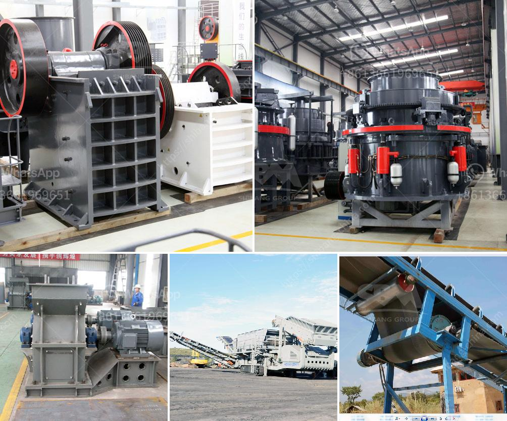

<h3>rotary kiln manufacturers in australia</h3>
Rotary kilns are essential equipment in various industrial processes, particularly in the cement and minerals industries. These cylindrical, high-temperature furnaces are used for drying, calcination, sintering, and other thermal treatment processes. When it comes to reliable and efficient rotary kilns, Australia boasts several reputable manufacturers.

One of the leading rotary kiln manufacturers in Australia is FLSmidth. With over a century of experience in engineering and process solutions, FLSmidth has a strong reputation for delivering innovative and reliable equipment. The company's rotary kilns are widely used in various industries, including steel, minerals processing, cement, and waste-to-energy.

Another prominent manufacturer is Metso Outotec, which brings expertise in sustainable technology and intelligent solutions. Metso Outotec's rotary kilns are designed to optimize energy efficiency, minimize emissions, and ensure reliable operations. These kilns are commonly used for minerals processing, such as lime and copper production.

Additionally, ANKO Lead and Zinc Smelting Technology, based in Melbourne, specializes in customized rotary kiln solutions for the smelting industry. With its cutting-edge technology and commitment to sustainability, ANKO has become a trusted partner for lead and zinc producers in Australia and beyond.

Economic Cemtec Pty Ltd is another Australian manufacturer that offers a wide range of rotary kilns. The company's kilns are designed to meet specific customer requirements and are known for their high-quality construction and exceptional performance. Furthermore, Economic Cemtec provides excellent after-sales support, ensuring its customers get the most out of their rotary kilns.

These rotary kiln manufacturers in Australia demonstrate the country's expertise in engineering reliable and advanced thermal processing equipment. With their innovative designs, sustainable solutions, and commitment to customer satisfaction, these manufacturers contribute to the growth of various industries, not only within Australia but also globally.

In conclusion, rotary kiln manufacturers in Australia play a vital role in providing advanced, reliable, and efficient equipment for various industrial processes. Their expertise and commitment to innovation help industries optimize their operations, improve energy efficiency, and reduce emissions. With a wide range of customized solutions, Australian manufacturers are trusted partners for customers worldwide.
<h3>Contact us</h3><ul><li><strong>Whatsapp:&nbsp;<a href="https://wa.me/8613661969651">+8613661969651</a></strong></li><li><a href="https://swt.shibang-china.com/?git&amp;zhl&amp;rotary kiln manufacturers in australia"><strong>Online Service(chat now)</strong></a></li></ul><h3>Related</h3><ul><li><a href='impact crusher machine.md'>impact crusher machine</a></li><li><a href='hammer mill new zealand.md'>hammer mill new zealand</a></li><li><a href='gypsum board crusher machine.md'>gypsum board crusher machine</a></li><li><a href='cost of the process of mining limestone.md'>cost of the process of mining limestone</a></li><li><a href='limestone powder making plant ireland.md'>limestone powder making plant ireland</a></li></ul>