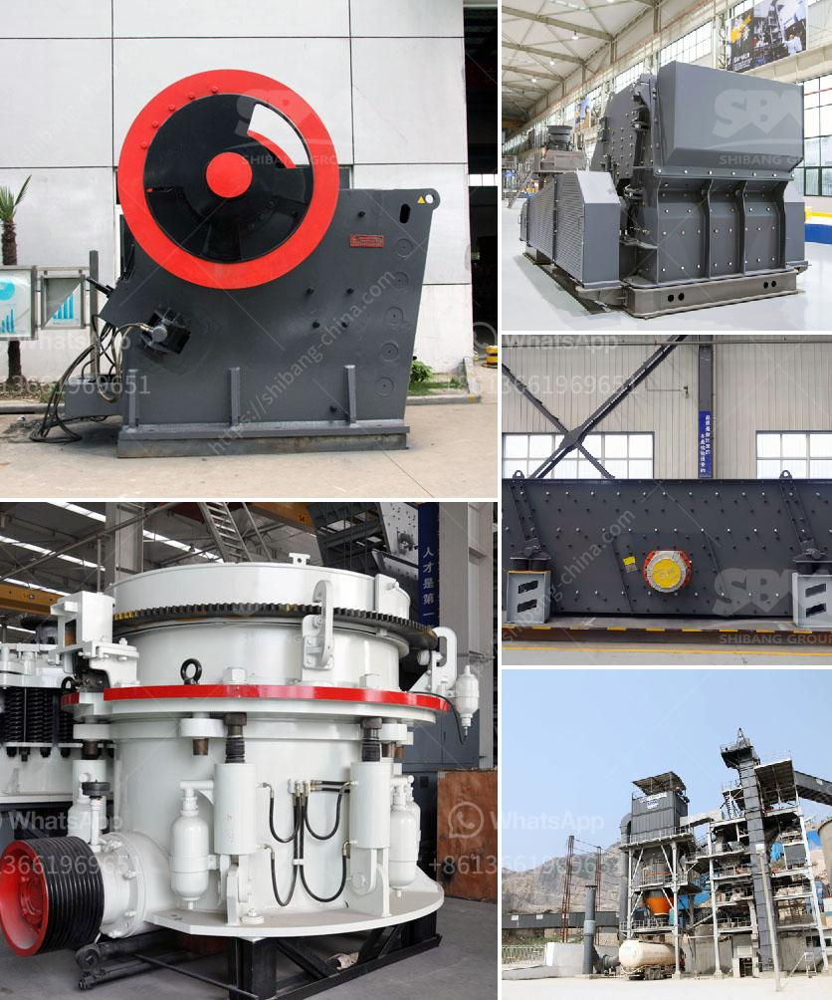

<h3>sale limestone crusher malaysia</h3>
Limestone is one of the most common rock types in the world and is widely used as a raw material for various industries. Limestone is widely used to crush rocks for the construction, highway and industrial projects. With the development of the economy, the vast majority of investors have chosen to mine limestone for its low price and high-output benefits.

Limestone is widely available and relatively easy to crush or grind, therefore it is used as a construction material in large quantities. It is also used in various industrial applications such as cement, filler material, paper, paint, rubber, and plastics. Limestone is an important raw material for the production of cement, as it sets and hardens when mixed with water, forming a durable and strong construction material.

As the demand for limestone increases in the construction industry, the demand for limestone crusher is also on the rise. In recent years, with the rapid development of the construction industry in Malaysia, the demand for crushers has increased significantly. Many customers in Malaysia have invested in the limestone crushing industry.

After mining limestone, it needs to be crushed and processed into suitable size for various applications. The limestone crushing process is accomplished by a series of crushing and screening stages. Impact crushers, jaw crushers, gyratory crushers, cone crushers, and vertical shaft impact crushers are used for primary and secondary crushing. After crushing, the size of the material is further reduced to make it suitable for final processing. Jaw crushers and gyratory crushers are commonly used for initial size reduction.

Malaysia has a wide range of limestone crushers available for sale, including jaw crushers, impact crushers, cone crushers, VSI crushers, hammer crushers, etc. Different crushers have different crushing capabilities and are suitable for different applications. Therefore, it is important to determine the specific needs and evaluate the crushing capabilities of different crushers before making a purchase.

When choosing a limestone crusher, it is necessary to consider the factors such as production capacity, energy consumption, equipment quality, and maintenance convenience. In addition, it is also important to consider the local market conditions and choose a suitable crusher that can maximize the economic benefits.

In conclusion, the sale of limestone crusher in Malaysia has been a topic of concern to many customers. This article mainly introduces the working principle of the limestone crusher, the advantages and highlights of the crusher, and the price of limestone crusher. As for the price, it will be affected by many factors such as the quality of the equipment, the price of raw materials, the configuration of the production line, and so on. Therefore, customers should analyze and compare various factors comprehensively, choose a suitable limestone crusher, and purchase it at a reasonable price to maximize the economic benefits.
<h3>Contact us</h3><ul><li><strong>Whatsapp:&nbsp;<a href="https://wa.me/8613661969651">+8613661969651</a></strong></li><li><a href="https://swt.shibang-china.com/?git&amp;zhl&amp;sale limestone crusher malaysia"><strong>Online Service(chat now)</strong></a></li></ul><h3>Related</h3><ul><li><a href='used sand wash equipment.md'>used sand wash equipment</a></li><li><a href='mobile stone crusher price in zimbabwe.md'>mobile stone crusher price in zimbabwe</a></li><li><a href='chrome ore ferro chrome plant construction plants.md'>chrome ore ferro chrome plant construction plants</a></li><li><a href='stone crusher machine price for plant.md'>stone crusher machine price for plant</a></li><li><a href='quartz stone machine of india.md'>quartz stone machine of india</a></li></ul>