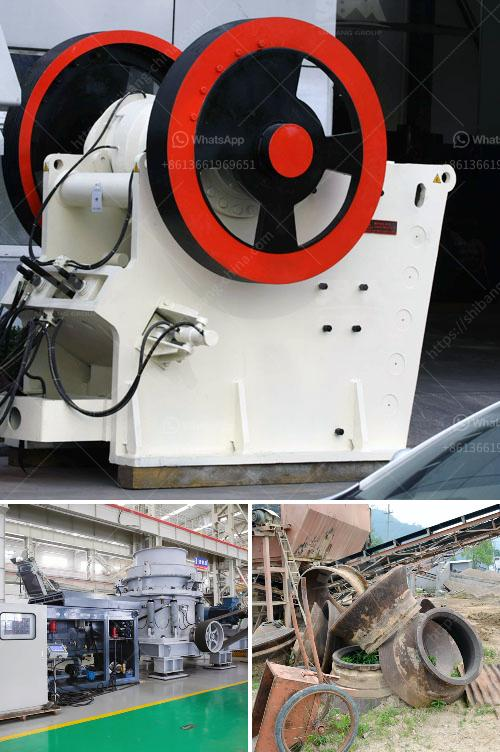

<h3>sale of running stone crusher in philippines</h3>
The Philippines is one of the world's largest producers of natural resources, particularly minerals. With its rich mineral deposits, the country has become a thriving haven for mining and quarrying industries. However, quarrying activities involve certain processes that need heavy-duty machinery, such as stone crushers, to break down large stones into more manageable sizes.

A stone crusher is a machine designed to reduce large rocks into smaller rocks, gravel, sand, or rock dust. It can be used to crush various stones, such as limestone, basalt, granite, pebbles, and other materials. A stone crusher is also sometimes called a rock crusher or a boulder crusher.

Initially, it was used in the construction industry, where stones needed to be crushed to produce concrete. However, over time, the applications of stone crushers have expanded, and they are now used in various industries, such as mining, cement, and even landscaping.

In the Philippines, the sale of stone crushers has been a booming industry for several decades. Many farmers and businessmen have invested in its installation on their farms or quarry sites. Crushing stones not only increases the yield of their land but also generates huge profits.

The sale of running stone crushers in the Philippines is considered to be a particularly attractive investment opportunity. With the country's rapid economic growth and thriving mining and construction industries, there is a huge demand for stone crushers.

A stone crusher plant consists of various types of stone crushers, including jaw crushers, cone crushers, impact crushers, and even portable crushers. Each stone crusher has different specifications and functions, and it carries out the crushing process differently.

For instance, a jaw crusher is commonly used for primary crushing, where large stones are initially crushed before being further processed. On the other hand, cone crushers are typically used for secondary or tertiary crushing, reducing stones into finer sizes. Impact crushers, on the other hand, are suitable for crushing materials with higher hardness or requiring specific particle sizes.

Besides the technical specifications, there are also different sizes and capacities of stone crushers available in the market. Farmers or quarry owners can choose the most suitable stone crusher plant depending on their specific needs and requirements.

In recent years, the sale of stone crushers in the Philippines has seen a tremendous rise. This can be attributed to the increasing demand for infrastructure development, such as roads, bridges, and buildings. The construction industry heavily relies on stone aggregates, and thus, the need for stone crushers becomes crucial.

Moreover, the mining industry in the Philippines also contributes to the high demand for stone crushers. Mining activities involve the extraction of valuable minerals, which often necessitates the crushing of rocks to extract the desired minerals.

Overall, the sale of running stone crushers in the Philippines provides a lucrative investment opportunity for individuals and businesses. With the country's robust economic growth and increasing infrastructure development and mining activities, the demand for stone crushers is expected to continue to rise. Investors who tap into this industry are likely to reap substantial profits, making it an attractive venture to consider.
<h3>Contact us</h3><ul><li><strong>Whatsapp:&nbsp;<a href="https://wa.me/8613661969651">+8613661969651</a></strong></li><li><a href="https://swt.shibang-china.com/?git&amp;zhl&amp;sale of running stone crusher in philippines"><strong>Online Service(chat now)</strong></a></li></ul><h3>Related</h3><ul><li><a href='barytes pulverizer equipment.md'>barytes pulverizer equipment</a></li><li><a href='ball mills layout.md'>ball mills layout</a></li><li><a href='quarrying crusher in zimbia.md'>quarrying crusher in zimbia</a></li><li><a href='roller mill working.md'>roller mill working</a></li><li><a href='talc powder making.md'>talc powder making</a></li></ul>