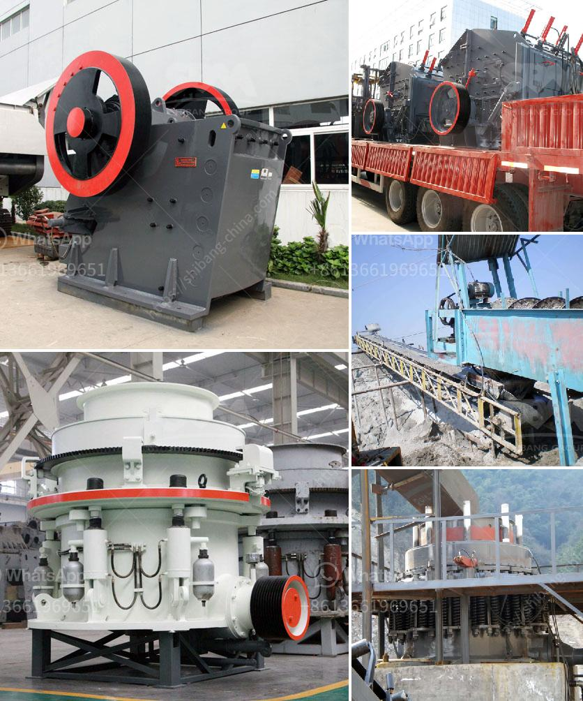

<h3>salt crusher plant process price</h3>
Salt is a versatile and essential mineral that is used in various industries and households around the world. Whether it's for cooking, preserving food, or manufacturing processes, salt plays a crucial role. As the demand for salt increases, so does the need for efficient salt crusher plants to extract this precious mineral.

The salt crusher plant process involves extracting the salt from underground rock deposits and refining it to be pure and fit for consumption or industrial use. This process starts with drilling and blasting rock salt deposits, followed by transportation to the crushing and screening plant. The crusher breaks the rock salt down to a smaller size, which is then transported to the screening plant for further processing.

At the screening plant, various machinery and equipment are used to remove impurities and separate the salt crystals into different sizes. This ensures that the final product meets the desired quality and specifications. The salt crystals are then washed and dried to remove any remaining impurities or moisture.

The price of a salt crusher plant depends on various factors, including the capacity, production rate, and the equipment used. These plants are designed to handle different types of salt, such as iodized or untreated rock salt, sea salt, or Himalayan pink salt. The price can range from a few hundred thousand dollars for a small-scale plant to several million dollars for a large-scale industrial plant.

Investing in a salt crusher plant can be highly profitable, considering the increasing demand for salt worldwide. However, it's crucial to choose the right equipment and machinery that best suits the specific requirements of the plant. Some key factors to consider include the plant's capacity, efficiency, and its ability to handle different types of salt.

In addition to the initial investment, operating costs such as labor, electricity, and maintenance should also be taken into account. It's essential to choose machinery that is energy-efficient and requires minimal maintenance to keep the overall operating costs low and maximize profits.

Furthermore, it's crucial to ensure that the salt crusher plant meets all safety and environmental regulations. The extraction and refining process should be carried out in an environmentally responsible manner to minimize any negative impact on the surrounding ecosystem.

In conclusion, the demand for salt is ever-increasing, making it essential to have efficient salt crusher plants that can extract and process salt in a cost-effective manner. The price of these plants can vary depending on their capacity and the equipment used. Investing in a salt crusher plant can be highly profitable, provided the plant is well-designed, efficient, and meets all safety and environmental regulations.
<h3>Contact us</h3><ul><li><strong>Whatsapp:&nbsp;<a href="https://wa.me/8613661969651">+8613661969651</a></strong></li><li><a href="https://swt.shibang-china.com/?git&amp;zhl&amp;salt crusher plant process price"><strong>Online Service(chat now)</strong></a></li></ul><h3>Related</h3><ul><li><a href='smallfine powder grinding machine nigeria.md'>smallfine powder grinding machine nigeria</a></li><li><a href='basalt quarry equipments.md'>basalt quarry equipments</a></li><li><a href='stone quarry machines.md'>stone quarry machines</a></li><li><a href='machinery required to extract the platinum.md'>machinery required to extract the platinum</a></li><li><a href='price of marble grinder mill.md'>price of marble grinder mill</a></li></ul>