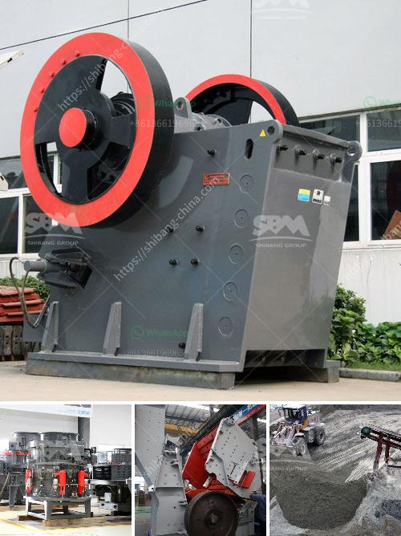

<h3>sample business plan for a stone mining</h3>
Are you considering starting a stone mining business? Stone mining is a highly lucrative venture, especially if you plan to extract stones for construction purposes. However, developing a business plan for your stone mining endeavors is crucial to ensure success. A well-structured business plan will outline your goals, target market, financial projections, and strategies to achieve sustained growth.

Firstly, you need to conduct thorough market research to understand the demand for stones in your area. Identify potential clients, such as construction companies, landscaping businesses, and individuals looking to purchase stones for decorative purposes. Determine the types of stones that are in demand, their sizes, and estimated quantities required.

Once you have gathered market data, outline your mining operations plan. This includes acquiring the necessary permits and licenses to operate legally. Outline the extraction methods you will employ, whether it's through open-pit mining or quarrying. Consider the equipment and machinery required for excavation and transportation.

Next, focus on the financial aspect of your business plan. Estimate the initial investment needed to start your stone mining venture, including costs for land acquisition, machinery, permits, and personnel. Research the market prices for stones and assess your operational costs, such as labor, maintenance, utilities, and marketing expenses.

Develop a marketing strategy to attract potential clients and create awareness about your stone mining business. Utilize online platforms, industry associations, and partnerships to reach your target market effectively. Network with construction professionals, architects, and landscapers to establish valuable contacts and secure profitable contracts.

Lastly, don't forget to include a contingency plan in your business strategy. Address potential risks, such as market fluctuations, changes in regulations, or unexpected maintenance costs. Having a backup plan will ensure that your stone mining business can adapt and thrive even during challenging times.

In conclusion, starting a stone mining business requires a comprehensive business plan that outlines your goals, market analysis, operational strategies, and financial projections. By following a well-structured plan, you increase your chances of success in this lucrative industry. So, take the time to develop a solid business strategy and embark on a journey towards a profitable stone mining enterprise.
<h3>Contact us</h3><ul><li><strong>Whatsapp:&nbsp;<a href="https://wa.me/8613661969651">+8613661969651</a></strong></li><li><a href="https://swt.shibang-china.com/?git&amp;zhl&amp;sample business plan for a stone mining"><strong>Online Service(chat now)</strong></a></li></ul><h3>Related</h3><ul><li><a href='cost of a stone crusher machine.md'>cost of a stone crusher machine</a></li><li><a href='stone crushing in mineral processing.md'>stone crushing in mineral processing</a></li><li><a href='tpd mini cement plant cost in india.md'>tpd mini cement plant cost in india</a></li><li><a href='stone crusher machine price list in bangladesh.md'>stone crusher machine price list in bangladesh</a></li><li><a href='ball mills 7 x 12 usa.md'>ball mills 7 x 12 usa</a></li></ul>