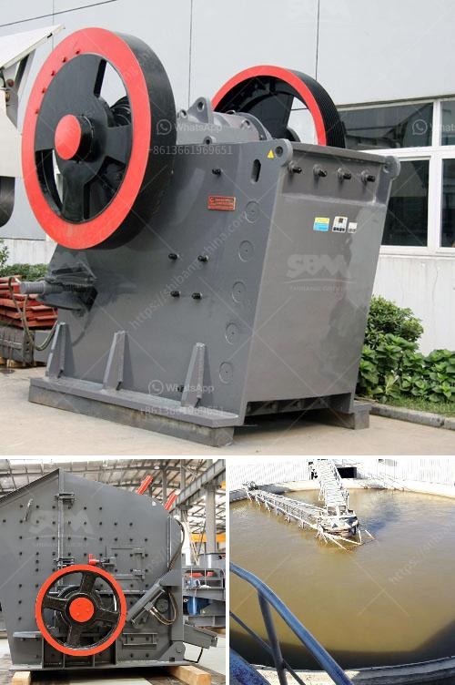

<h3>sample business plan for stone crusher</h3>
First of all, break the big stone boulders to smaller size manually. Then it is fed to the stone crusher. The crusher can accept the stone size of 175mm. Stone crushing is the two-stage process. In the first stage, crush the 175mm stone to about 50mm. Thereafter, fit the crusher with a conversion kit to enable granulation of 5 to 20mm. Then screen the crushed material by the rotary screen. Unit location is a major factor for stone crusher plant business.

Next, you can set up the unit depending on the availability of raw material and major commercial center. Stone crusher plant requires the high voltage of electricity. Apply for the connection in the local power station. Stone crusher plant is a labor-intensive operation. Follow the EPF and ESI norms according to the rule.

Land and machinery are the major fixed costs. However, you can establish stationary crushers at quarry heads. Mainly, at the construction site, you can use the portable crushers. Here we have explained the stationary stone crusher plant details.

Stone boulders are the only raw material required for the stone crusher plant. Related: 10 Self Rewarding Social Enterprise Business Ideas

Crushed stone is also known as metal jelly. Crushed stone is the most commonly used stone in construction. Construction aggregate is the filler material used for drainage, driveways, concrete, structural support, etc. The widespread use of crushed stone in construction projects can significantly contribute to the overall market growth.

Stone crushers are essential for the construction industry, as they produce the base material for many infrastructure projects. The demand for stone crushers is expected to be high during the forecast period due to the growth of the construction industry.

You can go for a bigger machine with a prime mover attached to it and gradually increase the production capacity. For a business with 500-1000 TPD production capacity, you will need two or more stationary crushers. One crusher can produce 200-500 tons of crushed stone material per day.

The operating costs of a stone crusher plant include personal wages, energy consumption, and maintenance costs. The operator’s personal costs are wages and benefits. Fuel costs for the plants are electricity and diesel fuel. Recurring maintenance costs are daily machine checks and routine servicing.

Starting a stone crusher business requires a lot of effort in terms of researching relevant industry information, understanding competitors, and identifying potential customers. It also requires extensive marketing and promotion strategies to build a strong customer base and gain a competitive advantage.

A stone crusher plant is a profitable venture for new entrepreneurs. The demand for crushed stone is expected to continue to grow with the growth of its user industry. The unit can be set up depending on the availability of raw materials and major commercial centers. Stone crusher plants are available in two major types, namely stationary and portable. Additionally, stone crushers are easy to operate, maintain, and transport, making them highly in demand in the construction industry.
<h3>Contact us</h3><ul><li><strong>Whatsapp:&nbsp;<a href="https://wa.me/8613661969651">+8613661969651</a></strong></li><li><a href="https://swt.shibang-china.com/?git&amp;zhl&amp;sample business plan for stone crusher"><strong>Online Service(chat now)</strong></a></li></ul><h3>Related</h3><ul><li><a href='type of conveyors belt pdf.md'>type of conveyors belt pdf</a></li><li><a href='sell 150 tph stone crusher.md'>sell 150 tph stone crusher</a></li><li><a href='dolomite powder grinding mill in india.md'>dolomite powder grinding mill in india</a></li><li><a href='gravel manufacturing company in thiruvallur district.md'>gravel manufacturing company in thiruvallur district</a></li><li><a href='mobile crusher in fiji.md'>mobile crusher in fiji</a></li></ul>