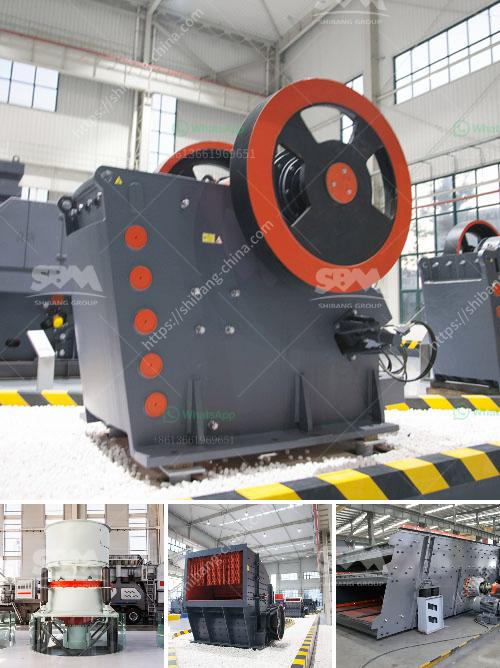

<h3>sample of joint operations agreement quarry mining</h3>
A joint operations agreement is an arrangement between two or more parties that allows them to collaborate and work together on a specific project or venture. In the mining industry, one common example of a joint operations agreement is in quarry mining. This agreement outlines the terms and conditions under which the parties will combine their resources and expertise to conduct mining activities at a particular quarry site.

The purpose of the joint operations agreement in quarry mining is to streamline the operations and maximize efficiency while minimizing costs and risks. By pooling their resources, the parties can share the expenses associated with mining equipment, labor, and infrastructure, allowing for more cost-effective operations. It also enables the parties to make use of each other's expertise and experience, thus leading to better results.

One crucial aspect of the joint operations agreement is the division of responsibilities and liabilities. The agreement should clearly state the roles and responsibilities of each party regarding the quarry mining operations. This includes tasks such as obtaining permits and licenses, conducting safety inspections, and managing extraction plans. By defining these roles, potential conflicts or misunderstandings can be avoided, ensuring a smooth operation.

The agreement should also outline the financial arrangements between the parties, including how profits and losses will be shared. This could be based on the percentage of investment contributed by each party or any other agreed-upon formula. Additionally, the agreement should specify the mechanism for resolving disputes and what actions can be taken in case of non-compliance.

In summary, a joint operations agreement in quarry mining allows multiple parties to come together and combine their resources, expertise, and responsibilities to conduct mining operations effectively. This collaborative approach not only maximizes efficiency but also reduces costs and risks. By outlining the terms and conditions of the agreement, all parties involved can ensure a mutually beneficial and successful venture.
<h3>Contact us</h3><ul><li><strong>Whatsapp:&nbsp;<a href="https://wa.me/8613661969651">+8613661969651</a></strong></li><li><a href="https://swt.shibang-china.com/?git&amp;zhl&amp;sample of joint operations agreement quarry mining"><strong>Online Service(chat now)</strong></a></li></ul><h3>Related</h3><ul><li><a href='mobile coal crusher for sale in south africa.md'>mobile coal crusher for sale in south africa</a></li><li><a href='mini crusher roller mill.md'>mini crusher roller mill</a></li><li><a href='cec rock crushers for sale.md'>cec rock crushers for sale</a></li><li><a href='ball mill inching drive.md'>ball mill inching drive</a></li><li><a href='quartz plants for sale.md'>quartz plants for sale</a></li></ul>