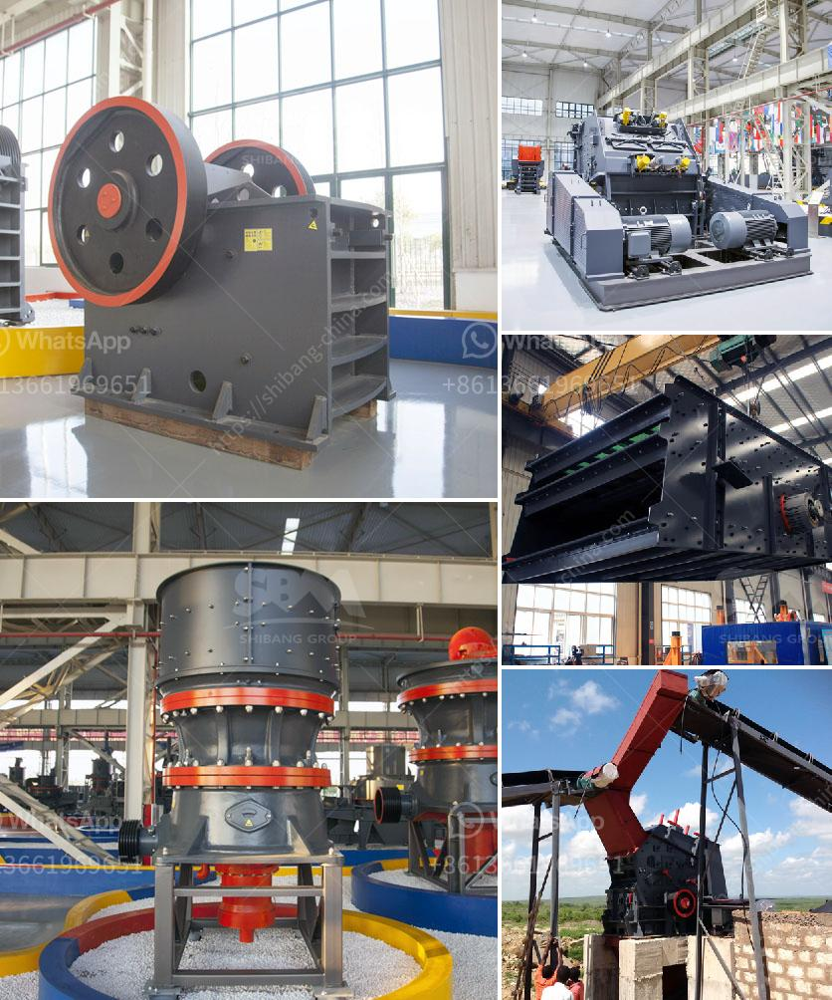

<h3>sand and gravel exploration equipment</h3>
Sand and gravel are valuable resources that play a crucial role in construction and infrastructure development. Their exploration requires specialized equipment that can efficiently extract and process these materials while minimizing environmental impact. In this article, we will explore the key equipment used in sand and gravel exploration and the benefits they offer.

One of the most widely used equipment in sand and gravel exploration is the dredge. Dredges are large machines that are capable of excavating underwater sediments and depositing them onto a barge or conveyor for further processing. They utilize powerful pumps to suction sand and gravel from the bottom of rivers, lakes, or oceans, and are ideal for large-scale projects. Dredges are not only efficient but also environmentally friendly, as they minimize disturbance to natural habitats.

In addition to dredges, excavators are essential equipment for sand and gravel exploration. These versatile machines are equipped with buckets or shovels specifically designed for digging and loading sediments. Excavators are commonly used in both small-scale and large-scale projects and can be operated on land or water. Their mobility and efficiency make them suitable for various exploration conditions, such as riverbanks or open-pit mines.

Conveyors are another vital piece of equipment in sand and gravel exploration. These systems transport the extracted materials from the excavation site to the processing plant. Conveyors can be customized to fit different lengths and angles, allowing for seamless transportation across different terrains. They are designed to handle heavy loads and can significantly reduce manual labor and operational costs.

Once the sand and gravel have been extracted, they need to be processed and classified into various sizes for different applications. This is where screening equipment comes into play. Screens, such as vibrating screens and trommel screens, are used to separate the desired particle sizes from the rest. They generate high-frequency vibrations or rotary motion to effectively sift through the materials. The screening process helps ensure that the final product meets the required specifications and quality standards.

To enhance the efficiency of sand and gravel exploration, a range of ancillary equipment is also used. This includes pumps to transport water for dredging operations, loaders to handle and transport materials on-site, and crushers to break down larger rocks into smaller particles. These ancillary equipment pieces work together with the main exploration equipment to optimize productivity and streamline the overall operation.

In conclusion, sand and gravel exploration equipment is crucial for the extraction and processing of these valuable construction materials. Dredges, excavators, conveyors, screens, and ancillary equipment are key components in this process and ensure efficient and sustainable sand and gravel exploration. By utilizing these specialized machines, construction companies can meet the growing demand for sand and gravel, while minimizing environmental impact and increasing productivity.
<h3>Contact us</h3><ul><li><strong>Whatsapp:&nbsp;<a href="https://wa.me/8613661969651">+8613661969651</a></strong></li><li><a href="https://swt.shibang-china.com/?git&amp;zhl&amp;sand and gravel exploration equipment"><strong>Online Service(chat now)</strong></a></li></ul><h3>Related</h3><ul><li><a href='crusher machine for sale kenya.md'>crusher machine for sale kenya</a></li><li><a href='movable stone crusher.md'>movable stone crusher</a></li><li><a href='cebu supplier of disposable jaw crusher.md'>cebu supplier of disposable jaw crusher</a></li><li><a href='list of the price of crushing plant turkey.md'>list of the price of crushing plant turkey</a></li><li><a href='manganese ore mining processing process equipment.md'>manganese ore mining processing process equipment</a></li></ul>