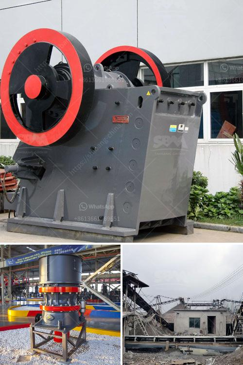

<h3>sand and gravel quarrying company in bicol</h3>
Title: Unveiling the Sand and Gravel Quarrying Industry in Bicol: Fueling Development through Sustainable Practices

The sand and gravel quarrying industry plays an essential role in the economic development of Bicol region. The region's rich deposits of aggregates contribute to the production of construction materials needed for infrastructure projects, making it a crucial sector that fuels growth in the area. This article delves into the operations of these quarrying companies in Bicol and highlights their commitment to sustainable practices.

Bicol's strategic location and abundant natural resources have driven substantial growth in the construction and infrastructure sector. The demand for aggregates, particularly sand and gravel, has skyrocketed as these materials form the foundation for road construction, building projects, and drainage systems. Mining companies in Bicol have recognized the untapped potential of the region's vast deposits. By harnessing these resources, they are actively contributing to the region's overall development and economic prosperity.

In recent years, sand and gravel quarrying companies in Bicol have embraced sustainable practices to mitigate the potential environmental impacts of their operations. These companies prioritize restoring the land affected by their activities, ensuring minimal or no permanent damage. They actively work towards reclaiming and rehabilitating quarry sites, turning them into productive and eco-friendly landscapes.

Quarrying companies in Bicol adhere to strict environmental standards, employing measures such as proper land use planning, vegetation restoration, and erosion prevention. They also invest in advanced technology and machinery to optimize resource extraction while minimizing adverse effects on the environment and neighboring communities. Furthermore, these companies actively engage in social responsibility initiatives, ensuring that the communities surrounding their operations benefit from the positive impacts of their businesses.

Collaboration and cooperation between quarrying companies, local government units, and community stakeholders play a vital role in the sustainable development of the region. Quarrying companies work hand in hand with local communities to address concerns, promote dialogue, and foster a shared responsibility in sustaining the environment.

Regular consultations, public hearings, and impact assessments are conducted to inform the affected communities and stakeholders about ongoing and future quarrying projects. This inclusive approach ensures that all parties collaborate effectively, fostering a sense of shared ownership and enabling sustainable decisions for both the industry and the surrounding communities.

The sand and gravel quarrying industry in Bicol, driven by sustainable practices and responsible resource management, plays a pivotal role in the region's development. By balancing economic growth, environmental stewardship, and social responsibility, the industry is leading the way toward a greener and more prosperous Bicol.
<h3>Contact us</h3><ul><li><strong>Whatsapp:&nbsp;<a href="https://wa.me/8613661969651">+8613661969651</a></strong></li><li><a href="https://swt.shibang-china.com/?git&amp;zhl&amp;sand and gravel quarrying company in bicol"><strong>Online Service(chat now)</strong></a></li></ul><h3>Related</h3><ul><li><a href='powdered limestone making places.md'>powdered limestone making places</a></li><li><a href='lime powder machine.md'>lime powder machine</a></li><li><a href='mobile jaw crusher for sale in pakistan.md'>mobile jaw crusher for sale in pakistan</a></li><li><a href='small sand grinding machine in india.md'>small sand grinding machine in india</a></li><li><a href='cost of 200tph stage bmw crushing plant.md'>cost of 200tph stage bmw crushing plant</a></li></ul>