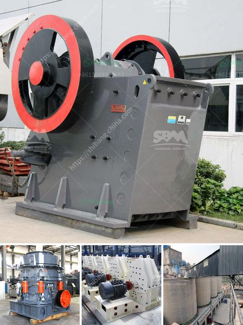

<h3>sand and gravel suppliers located in cebu</h3>
Sand and gravel are essential materials used in construction, and thus, finding a reliable supplier is crucial. The thriving city of Cebu in the Philippines is known for its abundant supply of sand and gravel. The city’s construction boom, coupled with the numerous infrastructure projects happening, has contributed to the high demand for sand and gravel. As a result, several suppliers have emerged in Cebu to meet this demand and provide top-quality materials for various construction needs.

One reputable sand and gravel supplier in Cebu is A & G Aggregates. Established in 1986, the company offers a wide selection of sand and gravel products for construction projects. Its primary markets include residential, commercial, and industrial construction, as well as government infrastructure projects. A & G Aggregates prides itself on its commitment to quality and customer satisfaction, making them a popular choice among contractors and project owners in Cebu.

Another well-established supplier in the region is LYG Marketing. With more than a decade of experience in the industry, LYG Marketing supplies a range of sand and gravel products, including crushed stone, gravel, and sand. The company caters to both commercial and residential projects, providing materials that meet the highest standards of quality. LYG Marketing understands the importance of timely delivery and ensures that their products reach their customers on schedule.

For large-scale infrastructure projects, Renato I. Jaca Gravel and Sand is a trusted supplier. They specialize in providing high-quality aggregates, including sand and gravel, for road construction, dams, bridges, and other significant projects. Renato I. Jaca Gravel and Sand ensure that their materials are sourced responsibly from approved quarries, meeting the required specifications of their clients. Their reputation for reliability and consistency has made them a preferred supplier for many renowned contractors operating in Cebu.

In addition to these suppliers, there are several other reliable sources of sand and gravel in Cebu. These include Ma. Danilo C. Sand and Gravel, Harish Gravel and Sand Supply, and Toledo Aggregates. These suppliers prioritize customer satisfaction and provide a wide range of products that cater to various construction needs.

When choosing a sand and gravel supplier in Cebu, it is essential to consider a few factors. First and foremost, check if the supplier has legal permits and licenses to operate, ensuring that their materials are sourced legally and responsibly. Look for suppliers with a considerable track record of reliability in terms of product quality and timely delivery. Additionally, it is crucial to consider the supplier's proximity to your project site, as this can significantly impact transportation costs and delivery efficiency.

Finding a trustworthy sand and gravel supplier is crucial for any construction project in Cebu. The suppliers mentioned above, alongside several others, have established themselves as pillars of the construction industry in this bustling city. Their commitment to quality, reliability, and customer satisfaction has cemented their reputation and made them the go-to choice for many contractors and project owners. By partnering with a reputable supplier, construction projects can proceed smoothly, with the assurance of receiving top-notch sand and gravel materials.
<h3>Contact us</h3><ul><li><strong>Whatsapp:&nbsp;<a href="https://wa.me/8613661969651">+8613661969651</a></strong></li><li><a href="https://swt.shibang-china.com/?git&amp;zhl&amp;sand and gravel suppliers located in cebu"><strong>Online Service(chat now)</strong></a></li></ul><h3>Related</h3><ul><li><a href='low cost jaw crusher for sale in ethiopia.md'>low cost jaw crusher for sale in ethiopia</a></li><li><a href='grinding mill machine price in chennai.md'>grinding mill machine price in chennai</a></li><li><a href='conical ball mill manufacturers in india.md'>conical ball mill manufacturers in india</a></li><li><a href='jaw crusher machine in south africa.md'>jaw crusher machine in south africa</a></li><li><a href='stone quarry machines for sale.md'>stone quarry machines for sale</a></li></ul>