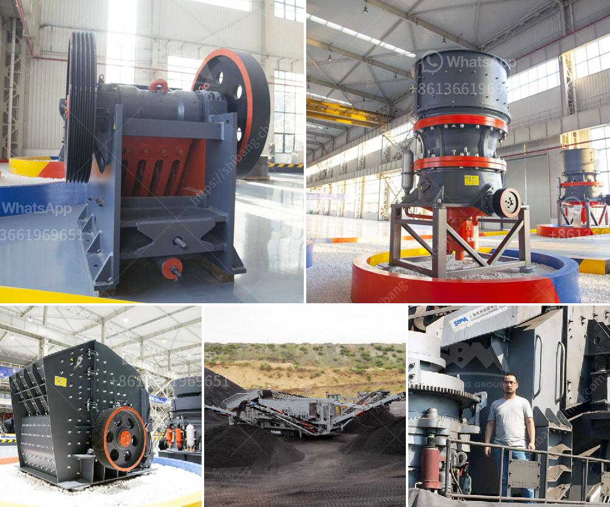

<h3>sand core machine manufacturers</h3>
Sand core machines play a crucial role in the foundry industry, enabling the production of complex and intricate metal castings. These machines are designed to create the internal cavities and intricate shapes within the metal casting, known as sand cores. As such, it is essential to choose reliable and efficient sand core machine manufacturers that can meet the demanding requirements of the industry.

Sand core machine manufacturers offer a wide range of products, catering to various foundry needs. These machines can be divided into two main categories: vertical and horizontal core shooters. Vertical core shooters are widely used for high-volume production, while horizontal core shooters are preferred for low to medium production.

One of the leading sand core machine manufacturers in the market is ABC Foundry Equipment. With years of experience and expertise, ABC Foundry Equipment has gained a strong reputation for delivering high-quality machines that meet the industry's rigorous standards. Their range of products includes both vertical and horizontal core shooters, designed to provide efficient and reliable performance.

Another renowned manufacturer in the field is XYZ Industries. XYZ Industries specializes in the production of advanced sand core machines, focusing on incorporating cutting-edge technology and innovation. Their machines offer superior precision, speed, and flexibility, enabling foundries to produce complex castings with ease.

When selecting a sand core machine manufacturer, it is essential to consider several factors. Firstly, the manufacturer's reputation and experience in the industry are critical. Established manufacturers with a proven track record are more likely to deliver reliable and durable machines. Additionally, it is crucial to evaluate the manufacturer's after-sales support, including service, spare parts availability, and technical assistance. A responsive and efficient support team is essential to minimize downtime and maximize productivity.

Moreover, the manufacturer's ability to customize their machines to meet specific foundry requirements is a significant advantage. Customization options can include different core box sizes, multiple core shooting heads, or the integration of automation systems. This flexibility ensures that the machine can adapt to the specific needs of the foundry, contributing to enhanced efficiency and productivity.

Safety is also a crucial consideration when choosing a sand core machine manufacturer. Manufacturers that prioritize safety by incorporating features such as interlocks, emergency stops, and guarding systems demonstrate their commitment to providing a safe working environment.

Furthermore, the use of environmentally friendly technologies and sustainability initiatives should be a priority for sand core machine manufacturers. Reduction of energy consumption, emissions, and waste generation contribute to a greener and more sustainable foundry industry.

In conclusion, sand core machine manufacturers play a vital role in the foundry industry, providing the necessary equipment for the production of intricate metal castings. Choosing the right manufacturer is crucial, considering factors such as reputation, experience, after-sales support, customization options, safety features, and sustainability initiatives. By selecting reliable manufacturers like ABC Foundry Equipment and XYZ Industries, foundries can ensure efficient and high-quality sand core production, contributing to their overall success in the industry.
<h3>Contact us</h3><ul><li><strong>Whatsapp:&nbsp;<a href="https://wa.me/8613661969651">+8613661969651</a></strong></li><li><a href="https://swt.shibang-china.com/?git&amp;zhl&amp;sand core machine manufacturers"><strong>Online Service(chat now)</strong></a></li></ul><h3>Related</h3><ul><li><a href='germany hammer crusher.md'>germany hammer crusher</a></li><li><a href='grinding mill machine in zimbabwe.md'>grinding mill machine in zimbabwe</a></li><li><a href='stone jaw crusher ppt for seminar.md'>stone jaw crusher ppt for seminar</a></li><li><a href='screw conveyor blade calculation.md'>screw conveyor blade calculation</a></li><li><a href='stone mining crusher in jharkhand.md'>stone mining crusher in jharkhand</a></li></ul>