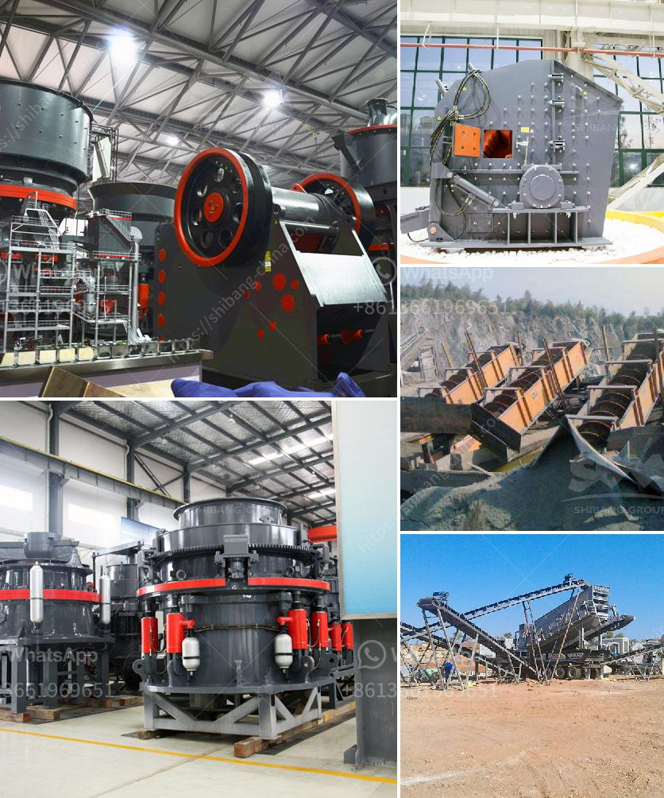

<h3>sand crusher machine hyderabad for sale</h3>
Sand mining is a widespread phenomenon in many parts of the world, including India. The demand for sand is high due to various construction activities and infrastructural developments. However, the indiscriminate and illegal sand mining has resulted in environmental degradation and loss of livelihoods for many communities.

In recent years, there has been a significant shift towards using manufactured sand (M-sand) as an alternative to natural river sand. M-sand is produced by crushing rocks, quarry stones, or larger aggregates into sand-sized particles. It offers several advantages over natural sand, such as consistent quality, better strength, and reduced environmental impact.

One of the key machines used for this purpose is the sand crusher machine. These machines are designed to crush rocks and convert them into sand particles. Sand crushers are used not only in the construction industry but also in mining operations, metal refining, and other industries.

The rapid urbanization and infrastructural development in Hyderabad, one of the major cities in India, has increased the demand for sand. However, the availability of natural river sand is limited, and there are concerns about its quality and sustainability. This has led to a rise in the popularity of M-sand and the demand for sand crusher machines in Hyderabad.

Sand crusher machines are available in various models and capacities. The range starts from a few tons per hour and goes up to hundreds of tons per hour. The popular models include Jaw crushers, Cone crushers, and Vertical Shaft Impactors (VSI). The jaw crushers are commonly used for primary crushing and the cone crushers are used for secondary and tertiary crushing.

The VSI crushers, on the other hand, are used to produce sand particles of finer quality. These machines utilize high-speed rotor and anvils for producing highly cubical and uniform sand particles. They are especially suitable for producing sand for concrete and asphalt production.

In Hyderabad, the sand crusher machines are sold by various dealers and manufacturers who are providing wide range of machines to the customers. These machines include jaw crushers, cone crushers, impact crushers, stone crushers, vertical shaft impact crushers, and sand making machines. In the market, there are many manufacturers and suppliers of these machines, which has led to fierce competition among them.

To choose the right sand crusher machine in Hyderabad, it is important to look for reputed and experienced manufacturers who can deliver machines with high performance and low maintenance. The machines should be efficient in producing high-quality sand particles and should have a robust construction to withstand the heavy working conditions.

Before purchasing a sand crusher machine in Hyderabad, it is also important to consider the after-sales service provided by the manufacturer. The manufacturer should have a strong service network and should be able to provide timely maintenance and repairs. Additionally, it is advisable to check for warranties and guarantees offered by the manufacturer.

In conclusion, the demand for sand crusher machines in Hyderabad is on the rise due to increasing construction activities and the need for alternative sources of sand. These machines play a crucial role in converting rocks into sand particles of desired sizes and quality. However, it is important to choose a reliable and reputed manufacturer who can provide efficient and high-performing machines to meet the growing demand for sand in Hyderabad.
<h3>Contact us</h3><ul><li><strong>Whatsapp:&nbsp;<a href="https://wa.me/8613661969651">+8613661969651</a></strong></li><li><a href="https://swt.shibang-china.com/?git&amp;zhl&amp;sand crusher machine hyderabad for sale"><strong>Online Service(chat now)</strong></a></li></ul><h3>Related</h3><ul><li><a href='machine layout gypsum board manufacturing.md'>machine layout gypsum board manufacturing</a></li><li><a href='clay working clay powder making machine.md'>clay working clay powder making machine</a></li><li><a href='kaolin mill machine 400 mesh.md'>kaolin mill machine 400 mesh</a></li><li><a href='clay mill machine crusher price.md'>clay mill machine crusher price</a></li><li><a href='crusher processing machines nigeria.md'>crusher processing machines nigeria</a></li></ul>