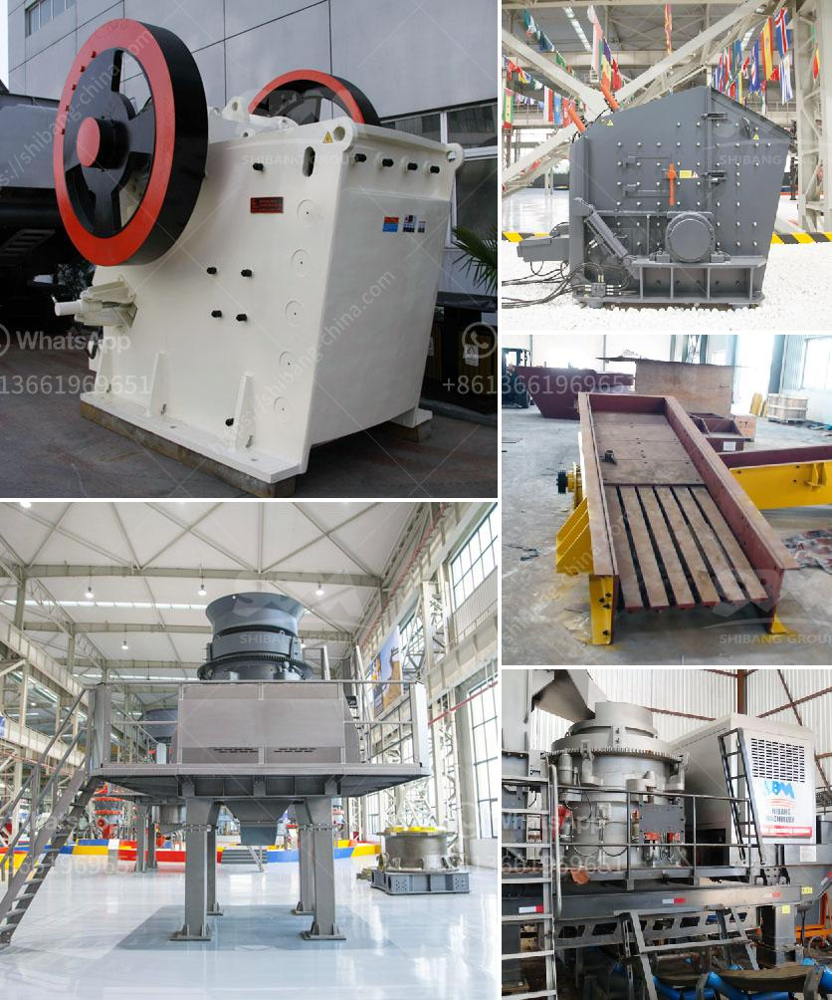

<h3>sand dry vacuum machine truk</h3>
When it comes to industrial cleaning, particularly dealing with sand and debris, one needs a reliable and high-performance machine that can handle the task efficiently. This is where sand dry vacuum machine trucks come into play. These robust vehicles are specifically designed to remove sand and other dry particles from large areas, making the cleaning process quicker, easier, and more effective.

One of the key features of sand dry vacuum machine trucks is their powerful suction system. Equipped with industrial-grade vacuum pumps, these trucks can generate an immense amount of suction, allowing them to efficiently remove sand and other dry materials from various surfaces. Whether it's a beach, construction site, or any area with heavy sand accumulation, the vacuum truck can quickly and effectively clean the space, saving time and labor.

Another crucial component of these machines is the advanced filtration system. As the vacuum truck sucks up the sand and debris, it passes through a series of filters that separate the collected material from the air. This ensures that only clean air is released back into the environment, minimizing air pollution. The filtration system also plays a significant role in prolonging the life of the vacuum pump by preventing abrasive materials from entering the system.

One of the standout advantages of sand dry vacuum machine trucks is their mobility and versatility. These trucks are designed to be highly maneuverable, allowing them to access even hard-to-reach areas. Their compact yet powerful design enables them to navigate through narrow streets, parking lots, and other confined spaces. Additionally, these machines can be easily transported from one location to another, making them ideal for use in various industries, including construction, mining, and environmental cleanups.

The efficiency of sand dry vacuum machine trucks is further enhanced by their large storage capacity. Equipped with extensive debris tanks, these vehicles can collect and store a significant amount of sand and other dry materials before needing to dispose of them. This results in fewer trips to unload the collected debris, reducing downtime and maximizing productivity on the job site.

Maintenance is a critical aspect of any heavy-duty machinery, and sand dry vacuum machine trucks are no exception. However, manufacturers have made significant strides in designing these machines for easy maintenance. Features like automatic self-cleaning filters and easily accessible components make it simpler for operators to keep the vacuum trucks in optimal working condition, reducing downtime and minimizing repair costs.

In conclusion, sand dry vacuum machine trucks have become indispensable for efficient and effective cleaning of large areas with sand accumulation. Their powerful suction, advanced filtration, mobility, and large storage capacity make them an ideal solution for removing sand and dry particles. With their ability to save time, effort, and labor costs, these machines have become a popular choice in various industries. So, if you have a sand-related cleaning or debris removal job, investing in a sand dry vacuum machine truck is undoubtedly a wise decision.
<h3>Contact us</h3><ul><li><strong>Whatsapp:&nbsp;<a href="https://wa.me/8613661969651">+8613661969651</a></strong></li><li><a href="https://swt.shibang-china.com/?git&amp;zhl&amp;sand dry vacuum machine truk"><strong>Online Service(chat now)</strong></a></li></ul><h3>Related</h3><ul><li><a href='difference between primary and secondary jaw crusher.md'>difference between primary and secondary jaw crusher</a></li><li><a href='granite quarry business plan pdf.md'>granite quarry business plan pdf</a></li><li><a href='vertical grinder mill price.md'>vertical grinder mill price</a></li><li><a href='used roller mill in kenya.md'>used roller mill in kenya</a></li><li><a href='super fine powder mill.md'>super fine powder mill</a></li></ul>