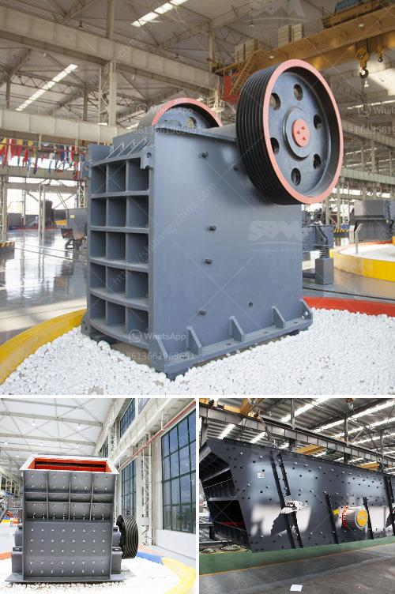

<h3>sand dryer machines suppliers south africa</h3>
South Africa is a country rich in mineral resources. It is one of the leading countries in the production of coal and gold, as well as platinum. However, the mining industry has been facing various challenges, including the issue of moisture content in the mined sand. This is where sand dryer machines suppliers in South Africa play a crucial role.

Sand dryer machines are designed to dry granular materials, including sand, mineral ores, and other materials with high moisture content. These machines have been widely used in the mining industry, construction sites, and other industrial sectors. They help reduce the moisture content in the sand, making it suitable for further processing and use.

In South Africa, there are several suppliers of sand dryer machines. These suppliers provide quality machines that are designed to meet the specific requirements of the customers. They offer a wide range of sand dryer machines, including rotary dryers, fluidized bed dryers, and drum dryers. These machines are available in different capacities and sizes to cater to the needs of various industries.

One of the leading suppliers of sand dryer machines in South Africa is Benco Machines. They have been providing reliable and efficient solutions for the mining and construction industry for over 40 years. Benco Machines offer a wide range of sand dryer machines that are designed to deliver high performance and energy efficiency. Their machines are known for their durability and long service life.

Another reputable supplier in South Africa is Drytech. They offer innovative and cost-effective sand dryer machines that are designed to meet the specific needs of their clients. Drytech has a team of experienced engineers who ensure that their machines are of the highest quality and meet international standards.

In conclusion, sand dryer machines suppliers in South Africa play a crucial role in the mining and construction industry. They provide quality machines that help remove moisture from the sand, making it suitable for various applications. With reliable and efficient machines, these suppliers contribute to the growth and development of various industries in South Africa.
<h3>Contact us</h3><ul><li><strong>Whatsapp:&nbsp;<a href="https://wa.me/8613661969651">+8613661969651</a></strong></li><li><a href="https://swt.shibang-china.com/?git&amp;zhl&amp;sand dryer machines suppliers south africa"><strong>Online Service(chat now)</strong></a></li></ul><h3>Related</h3><ul><li><a href='vertical mill for sale.md'>vertical mill for sale</a></li><li><a href='write an article about jaw crusher philippines prices with 100300 words.md'>write an article about jaw crusher philippines prices with 100-300 words</a></li><li><a href='jaw crusher design handbook.md'>jaw crusher design handbook</a></li><li><a href='basalt curb stone crusher price.md'>basalt curb stone crusher price</a></li><li><a href='sand crusher machine hyderabad for sale.md'>sand crusher machine hyderabad for sale</a></li></ul>