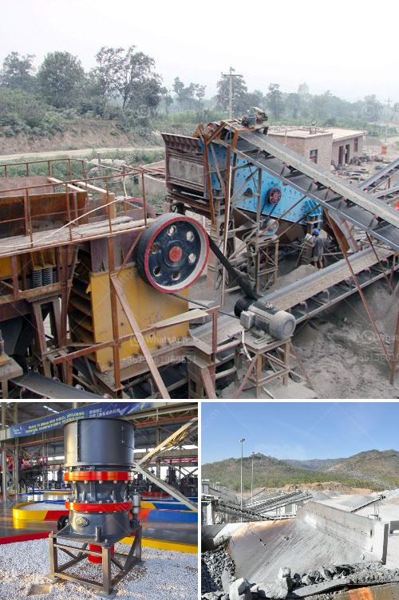

<h3>sand making machine suppliers in coimbatore</h3>
Sand is an essential component in construction, and sand making machines play a vital role in producing high-quality sand for infrastructure projects such as buildings, highways, bridges, and tunnels. Coimbatore, also known as the Manchester of South India, is a hub for machinery manufacturing and the sand-making industry is no exception. With several sand making machine suppliers in Coimbatore, it is no surprise that this city is home to countless construction projects.

One of the renowned suppliers of sand making machines in Coimbatore is Propel Industries. They manufacture a wide range of sand making machines including HSI (Horizontal Shaft Impact) crushers, VSI (Vertical Shaft Impact) crushers, and Dewatering screens. These machines are designed to produce high-quality sand with a combination of efficiency and durability.

Another popular supplier in Coimbatore is Deepa Machinery Manufacturers Pvt Ltd. They offer a comprehensive range of sand making machines that cater to different construction needs. Their machines are known for their robustness and efficient operation, ensuring that customers get the best value for their investment.

Universal Construction Machinery & Equipment Ltd is also a reputable supplier of sand making machines in Coimbatore. They offer a diverse range of machines that are specifically engineered for efficient sand production. With their cutting-edge technology and precision engineering, Universal Construction Machinery is a trusted choice for many construction companies.

Apart from these major suppliers, there are several other manufacturers and suppliers in Coimbatore who cater to the demand for sand making machines. These suppliers continuously innovate and upgrade their machines to ensure that they meet the evolving needs of the construction industry.

The presence of numerous sand making machine suppliers in Coimbatore highlights the city's commitment to providing the construction industry with reliable and high-quality machinery. These suppliers contribute to the growth and development of infrastructure projects by supplying state-of-the-art sand making machines. With their unparalleled quality and performance, these machines help in producing sand that meets the stringent requirements of construction projects.

In conclusion, the availability of sand making machine suppliers in Coimbatore has been instrumental in meeting the growing demand for high-quality sand. These suppliers offer a wide range of machines that cater to different construction needs. The industry's commitment to innovation and efficiency ensures that Coimbatore continues to be a major hub for sand making machines in the construction sector.
<h3>Contact us</h3><ul><li><strong>Whatsapp:&nbsp;<a href="https://wa.me/8613661969651">+8613661969651</a></strong></li><li><a href="https://swt.shibang-china.com/?git&amp;zhl&amp;sand making machine suppliers in coimbatore"><strong>Online Service(chat now)</strong></a></li></ul><h3>Related</h3><ul><li><a href='river stone crushing plant crusher.md'>river stone crushing plant crusher</a></li><li><a href='stone crusher machine price list in bangladesh.md'>stone crusher machine price list in bangladesh</a></li><li><a href='gyratory gyratory crusher manufacturer in india.md'>gyratory gyratory crusher manufacturer in india</a></li><li><a href='grinding machine activated carbon.md'>grinding machine activated carbon</a></li><li><a href='coal crusher types.md'>coal crusher types</a></li></ul>