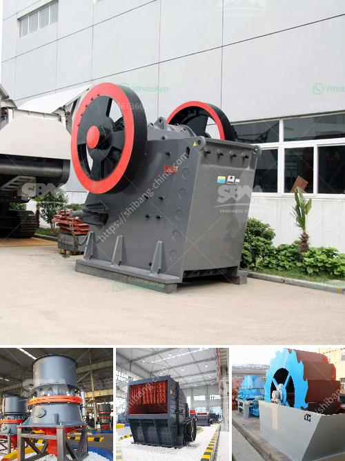

<h3>sand making machine</h3>
The rapid growth of infrastructure projects has led to an increasing demand for sand. Whether it is used in construction, road building, or landscaping, sand plays a crucial role in these industries. However, with the depletion of natural sand resources and the environmental concerns associated with sand extraction, the need for an efficient and sustainable alternative has become more urgent. This is where sand making machines come into play.

A sand making machine, also known as a sand maker, is a device that is used to produce artificial sand. These machines are broadly utilized in various sectors such as construction, mining, metallurgy, and highways. Additionally, they are also used in the production of aggregates for various uses such as asphalt and concrete production.

One of the significant advantages of sand making machines is their ability to produce sand in a controlled and consistent manner. Unlike natural sand, which may have varying shapes and sizes, artificial sand produced by these machines has a uniform composition and grain size. This uniformity in the sand's properties ensures better performance and stability in construction applications.

Sand making machines operate by feeding large pieces of materials into a crushing chamber, where they are crushed by the high-speed rotating hammers. The crushed materials then pass through a series of screens to separate the desired grain size. These machines can produce sand of different sizes to meet specific requirements. Moreover, they can also shape the sand particles to create a more angular and cubical shape, which enhances the strength and durability of the material.

Apart from the consistent quality of the sand produced, sand making machines also offer several other advantages over traditional methods of sand extraction. It eliminates the need for natural sand, reducing the pressure on riverbeds and coastal areas where sand is usually extracted from. Additionally, sand produced by these machines is free of impurities such as clay, silt, and other organic materials, resulting in better performance and improved workability.

Furthermore, sand making machines are designed to be energy efficient and environmentally friendly. They consume less power compared to traditional methods, reducing both operational costs and carbon emissions. The use of sand making machines also minimizes the need for transportation, as the sand can be produced on-site or close to the construction site. This further reduces fuel consumption and lowers the overall environmental footprint.

In conclusion, sand making machines have emerged as a sustainable solution to meet the growing demand for sand in various industries. Their ability to produce high-quality and consistent sand, as well as their energy efficiency and environmental friendliness, make them an attractive choice for construction companies and infrastructure projects. As technology continues to advance, we can expect further improvements in sand making machines, ensuring a continuous supply of sand while minimizing the impact on the environment.
<h3>Contact us</h3><ul><li><strong>Whatsapp:&nbsp;<a href="https://wa.me/8613661969651">+8613661969651</a></strong></li><li><a href="https://swt.shibang-china.com/?git&amp;zhl&amp;sand making machine"><strong>Online Service(chat now)</strong></a></li></ul><h3>Related</h3><ul><li><a href='marble grinder mill machine price in pakistan.md'>marble grinder mill machine price in pakistan</a></li><li><a href='screw feeder capacity 5 ton hour.md'>screw feeder capacity 5 ton hour</a></li><li><a href='ball mills prices.md'>ball mills prices</a></li><li><a href='raymond mill for grinding gypsum.md'>raymond mill for grinding gypsum</a></li><li><a href='portable machine stone crusher machine for sale.md'>portable machine stone crusher machine for sale</a></li></ul>